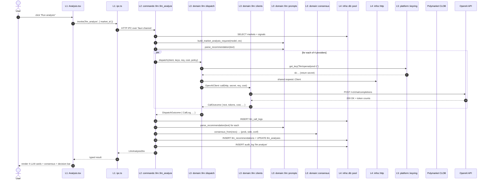

# polyrocket — Architecture Overview

> 项目架构分层设计 / 模块清单 / 目录结构 / 数据流 / 迁移路线
>
> 版本：v2.1 · 2026-06-18 (v0.39 — system notification on auto-promote)
> 配套：[`polyrocket-modules.md`](./polyrocket-modules.md)（17 个 module 业务说明） · [`polyrocket-flows.md`](./polyrocket-flows.md)（20 个交互流程） · [`polyrocket-ui-design.md`](./polyrocket-ui-design.md)（18 页面 × 3 主题 UI 规范）
> 强约束：[`polyradar-dev-governance.md §11`](../polyradar-dev-governance.md) — 三主题仅配色差异；`.env` 仅 dev 用途；OS keyring 是秘密唯一存储

---

## 0. 设计目标

polyrocket 是一个 Tauri 2 desktop 客户端（Rust 后端 + React 前端 + 嵌入式 SQLite）。本文件定义 **5 层架构**，使代码、文档、测试、CI 校验能按统一规则组织。

| 维度 | 目标 |
|---|---|
| **可理解性** | 一个新工程师 30 分钟内能找到任何代码的位置（按层定位） |
| **可测试性** | L3 (domain) 完全独立于 UI / IPC / DB，可纯函数单测 |
| **可演进性** | 加新 LLM provider、加新数据源、加新页面**不**需要改其他层 |
| **可治理性** | doc-sync / check 脚本能按层枚举（CI 防 regression） |
| **可移植性** | 未来从 Tauri 迁到其他壳（如 native webview / mobile）只需换 L1+L2 |

---

## 1. 5 层架构总览

```mermaid
graph TB
    subgraph P["Presentation Layer (L1)"]
        direction TB
        P1[React 18 + Vite + Tailwind]
        P2[18 routes · 32 components]
        P3[Zustand stores · hooks · IPC client]
    end

    subgraph A["Application Layer (L2)"]
        direction TB
        A1[commands/ — 39 IPC handlers]
        A2[state — AppState]
        A3[scheduler — manual triggers]
    end

    subgraph D["Domain Layer (L3)"]
        direction TB
        D1[llm — clients + dispatch + prompts + cost]
        D2[consensus — weighted median]
        D3[polymarket — CLOB client]
        D4[business logic (signal/bet/copy/pnl)]
    end

    subgraph I["Infrastructure Layer (L4)"]
        direction TB
        I1[db — SQLite pool + settings]
        I2[http — reqwest shared client]
        I3[error — AppError + AppResult]
        I4[scheduler — 3 tokio loops]
    end

    subgraph PL["Platform Layer (L5)"]
        direction TB
        PL1[keyring — macOS Keychain / Win Cred Mgr / Linux SS]
        PL2[env — POLYROCKET_* loader]
        PL3[paths — ~/Library/Application Support/...]
    end

    P -->|invoke| A
    A --> D
    A --> I
    D --> I
    D --> PL
    I --> PL
    I --> P
    style P fill:#007ACC,color:#fff
    style A fill:#4EC9B0,color:#fff
    style D fill:#DCDCAA,color:#000
    style I fill:#858585,color:#fff
    style PL fill:#F48771,color:#fff
```

### 1.1 各层一句话职责

| 层 | 职责 | 答的问题 |
|---|---|---|
| **L5 Platform** | OS 集成：keychain、env、文件系统路径 | "密钥/配置/数据**存在哪**？" |
| **L4 Infrastructure** | 持久化、网络、错误、调度 | "怎么**存** + 怎么**调**外部？" |
| **L3 Domain** | 业务核心：LLM 客户端、共识算法、业务规则 | "业务**怎么算**？" |
| **L2 Application** | 用例编排：IPC handlers、命令处理 | "UI 说一句话，后端**做什么**？" |
| **L1 Presentation** | UI 渲染、路由、状态、IPC 客户端 | "用户**看到**什么？**按**什么？" |

### 1.2 依赖规则（**严格单向**）

```
L1 → L2 → L3 → L4 → L5
```

| 规则 | 含义 | 例外 |
|---|---|---|
| **上层调下层** | 任何上层可调下层接口 | — |
| **下层不调上层** | L3 不知道 L1/L2 存在 | 唯一例外：`db` 返 Result 向上抛 |
| **同层不互相调** | L2 各 module 不直接调 L2 其他 module | 走 L3 (domain) 共享 |
| **L3 不调 L2** | domain 不知道 IPC / UI 存在 | 否则 domain 不可单测 |
| **L5 不可调 L1-L4** | platform 是叶子 | 调 = 循环依赖 |

**CI 校验**：用 `cargo metadata --format-version 1` + 自定义脚本扫 `mod xxx { ... }` 引用方向，违反即 fail。

---

## 2. 各层核心模块

### 2.1 Platform Layer (L5) — `src-tauri/src/platform/`

| Module | 路径 | 职责 | 关键 API |
|---|---|---|---|
| `keyring` | `platform/keyring/` | OS keychain 读写（mac/win/linux 三套 native impl） | `get_key(alias)`, `set_key(alias, secret)`, `delete_key(alias)`, `has_key(alias)`, `llm_alias()`, `wallet_alias()`, `pm_api_alias()` |
| `env` | `platform/env.rs` | 读 `POLYROCKET_*` 环境变量 + dev-mode `.env` 同步 | `maybe_load_dev_env()`, `sync_env_to_keyring(pairs)`, `parse_env_file(path)` |
| `paths` | `platform/paths.rs` | 解析 app data dir / temp / log 路径 | `app_data_dir()`, `db_path()`, `log_dir()` |

**关键不变量**：
- **唯一**允许调 OS API 的层；任何 L3 / L4 逻辑需要"存秘密"必须走 `keyring` builder
- `keyring` 是**唯一**接受 secret 字符串的入口；不在签名里暴露 secret
- env vars 命名空间：`POLYROCKET_<DOMAIN>_<KEY>`，**不**用 `POLYROCKET_*` 通用

### 2.2 Infrastructure Layer (L4) — `src-tauri/src/infra/`

| Module | 路径 | 职责 | 关键 API |
|---|---|---|---|
| `db::pool` | `infra/db/pool.rs` | SQLite 连接池 + WAL + FK + 初始化 | `init_pool(app_handle) -> SqlitePool` |
| `db::settings` | `infra/db/settings.rs` | `_polyrocket_settings` k/v 读写 | `get_setting(pool, k)`, `set_setting(pool, k, v)` |
| `http` | `infra/http/mod.rs` | 共享 `reqwest::Client`（连接池） | `new_http_client()` (process-singleton via `OnceCell`) |
| `error` | `infra/error.rs` | 统一 `AppError` + `AppResult<T>` | `AppError::Invalid`, `AppError::Auth`, `AppError::Internal`, `AppError::NotFound` |
| `state` | `infra/state.rs` | Tauri managed state（db pool + scheduler handle） | `AppState { db: SqlitePool }` |
| `scheduler` | `infra/scheduler.rs` | 3 个 tokio loop（health probe / daily brief / anomaly detect） | `start(pool, http) -> SchedulerHandle` |

**关键不变量**：
- 所有 SQL 都走 `sqlx::query` / `sqlx::query_as`，**不**直接用 `rusqlite`
- L4 不知道任何 module 业务名（`llm_*` / `bet_*` 都不在 L4 出现）
- 错误统一 `AppError`，**不**让 sqlx / reqwest 错误直接冒泡到 L2

### 2.3 Domain Layer (L3) — `src-tauri/src/domain/`

| Module | 路径 | 职责 | 关键类型/函数 |
|---|---|---|---|
| `llm::traits` | `domain/llm/mod.rs` | LLM 抽象 + 公共类型 | `LlmClient` trait, `CallRequest`, `CallOutcome`, `CallError`, `ProviderKind`, `CostRate`, `err::*` |
| `llm::clients::openai` | `domain/llm/clients/openai.rs` | OpenAI chat_completions | `OpenAIClient { api_base }` |
| `llm::clients::anthropic` | `domain/llm/clients/anthropic.rs` | Anthropic Messages API | `AnthropicClient::with_base(api_base)` |
| `llm::clients::google` | `domain/llm/clients/google.rs` | Google generateContent | `GoogleClient::with_base(api_base)` |
| `llm::clients::deepseek` | `domain/llm/clients/deepseek.rs` | DeepSeek (OpenAI compat + R1 max_tokens) | `DeepSeekClient::new()` |
| `llm::clients::custom` | `domain/llm/clients/custom.rs` | OpenAI/Anthropic 兼容代理 | `CustomClient::new_openai_compat()`, `::new_anthropic_compat()` |
| `llm::clients::common` | `domain/llm/clients/common.rs` | 共享 body builder + response parser | `build_body()`, `parse_response()`, `classify_status()` |
| `llm::dispatch` | `domain/llm/dispatch.rs` | key 轮询 + retry/backoff | `dispatch()`, `KeyHandle`, `RetryPolicy`, `DispatchOutcome`, `CallLog` |
| `llm::prompts` | `domain/llm/prompts.rs` | 3 个 prompt 模板 + JSON 解析 | `build_market_analysis_request()`, `parse_recommendation()`, 3 个 `PROMPT_VERSION_*` 常量 |
| `llm::cost` | `domain/llm/cost.rs` | 成本计算 | `CostRate::compute()` |
| `consensus` | `domain/consensus.rs` | 4-LLM 共识算法 | `consensus_from(recs) -> (prob, side, conf)` (weighted median) |
| `polymarket` | `domain/polymarket.rs` | Polymarket CLOB REST 客户端 | `place_order()`, `get_market()`, `get_orderbook()` |
| `signal` | `domain/signal.rs` | 信号生成 / 评分 / 过期 | `compute_signal()`, `expire_old_signals()` |
| `bet` | `domain/bet.rs` | 下单 / 结算 / P&L | `place_bet_mode_a()`, `place_bet_mode_b()`, `settle_bet()` |
| `copy` | `domain/copy.rs` | 目标地址监控 + 镜像 | `poll_target(addr)`, `mirror_order(order)` |
| `pnl` | `domain/pnl.rs` | 聚合统计 | `daily_pnl()`, `win_rate()`, `brier_score()` |
| `lab` | `domain/lab.rs` | 模型版本管理 | `train_job()`, `promote_model()` |
| `wallet` | `domain/wallet.rs` | 钱包业务规则 | `validate_pk()`, `derive_address()` |

**关键不变量**：
- **L3 完全可单测**：所有逻辑可纯函数化（不依赖 reqwest / Tauri / sqlx 实例）
- L3 接口**不**返回 `serde_json::Value`（用 typed struct）
- L3 错误用 `Result<T, AppError>`（不引入第三方错误类型）
- L3 模块**不**互相 import 跨子域（`llm` 不引 `signal`）

### 2.4 Application Layer (L2) — `src-tauri/src/commands/`

L2 是**用例编排**：每个 IPC handler 是"一句话办一件事"，负责：
1. 验证 + 解析入参
2. 查 / 写 DB (L4 `db::pool`)
3. 调 domain 函数 (L3)
4. 写 audit_log (L4 `audit_log` 表)
5. 返回 DTO

| Module | 路径 | 职责 | IPC 数量 |
|---|---|---|---|
| `wallet` | `commands/wallet.rs` | M4 钱包 CRUD | 2 |
| `market` | `commands/market.rs` | M1 市场查询 + sync | 2 |
| `signal` | `commands/signal.rs` | M2 信号查询 + 重算 | 2 |
| `bet` | `commands/bet.rs` | M3 mode A/B 下单 + 持仓 | 3 |
| `copy` | `commands/copy.rs` | M5 目标 + 事件 | 3 |
| `pnl` | `commands/pnl.rs` | M6 dashboard_kpis | 1 |
| `lab` | `commands/lab.rs` | M7 模型版本 | 1 (planned) |
| `llm` | `commands/llm.rs` | M10 llm_analyze (4-provider fan-out) + stats | 11 |
| `llm_mgmt` | `commands/llm_mgmt.rs` | M11 provider/key CRUD + test + traffic + stats | 12 |
| `secrets` | `commands/secrets.rs` | M11 PM CLOB 凭证 + wallet pk | 5 |
| `scheduler` | `commands/scheduler.rs` | 手动触发 health/brief | 3 |
| `brief` | `commands/brief.rs` | M12 Daily Brief get/dismiss/refresh | 4 |

**关键不变量**：
- 每个 handler **必须**写 `audit_log`（横切 X1）
- 每个 handler **必须**在 `state: State<'_, AppState>` 取 db pool
- handler **不**直接做业务计算，只编排

### 2.5 Presentation Layer (L1) — `src/`

| Module | 路径 | 职责 | 关键 API |
|---|---|---|---|
| `ipc` | `src/ipc.ts` | Tauri invoke 封装 + 类型化 DTO | `invoke<T>('cmd_name', { args })` + 39 个 typed wrapper |
| `routes/` | `src/routes/` | 18 页面（hash router） | `Dashboard`, `Markets`, ..., `Onboarding` |
| `components/base/` | `src/components/base/` | Button / Input / Card / Toggle | 8 组件 |
| `components/feedback/` | `src/components/feedback/` | Toast / Modal / Skeleton / Empty / Error | 7 组件 |
| `components/data/` | `src/components/data/` | KpiCard / Table / Chart / Sparkline | 10 组件 |
| `components/business/` | `src/components/business/` | ProviderRow / SignalCard / ConsensusCard | 5 组件 |
| `components/shell/` | `src/components/shell/` | Sidebar / Topbar / UserMenu / CommandPalette | 2 组件 |
| `state/` | `src/state/` | Zustand stores | `theme`, `notifications`, `cache` |
| `hooks/` | `src/hooks/` | React hooks | `useInvoke`, `useTheme`, `useShortcuts` |
| `lib/` | `src/lib/` | 工具 | `format.ts`, `i18n.ts` |
| `styles/` | `src/styles/` | Tailwind + CSS 变量 + 3 主题 | `themes.css` |
| `types/` | `src/types/` | TS 类型 (mirror Rust DTO) | `llm.ts`, `market.ts` |

**关键不变量**：
- L1 **不**直接调 `fetch` 走 HTTP；所有外部调用走 `invoke` → L2 IPC
- L1 **不**直接访问 keychain / filesystem；需要 L2 提供 IPC
- 3 主题用 `[data-theme='dark'|'light'|'matrix']` CSS 变量切换，DOM 结构**完全一致**

---

## 3. 完整目标目录树

```
polyrocket/
│
├── README.md                          # 项目一句话定位 + quickstart
├── package.json                        # pnpm workspace + scripts
├── pnpm-lock.yaml
├── tsconfig.json
├── tsconfig.node.json
├── vite.config.ts
├── tailwind.config.js                  # 3 主题 token 矩阵
├── postcss.config.js
├── .env.example                        # dev-only 模板
├── .gitignore                          # 已含 .env
├── .npmrc                              # allowBuilds 配置
│
├── docs/                               # 治理文档（governance）
│   ├── overview.md                     # ⭐ 本文件：架构总览
│   ├── polyrocket-modules.md           # 17 module 业务说明
│   ├── polyrocket-flows.md             # 20 flow (mermaid)
│   ├── polyrocket-ui-design.md         # 18 页 × 3 主题 UI 规范
│   ├── polyrocket-llm-analysis.md      # M10 业务 + 13.x 真实 HTTP
│   ├── polyrocket-llm-management.md    # M11 配置 + 13/14 secrets + scheduler
│   ├── prototype.html                  # 设计原型 (single-file 3091 行)
│   ├── previews/                       # 54 PNG (3 主题 × 18 页)
│   │   ├── dark/   *.png  (18)
│   │   ├── light/  *.png  (18)
│   │   └── matrix/ *.png  (18)
│   ├── polyradar-dev-governance.md      # 外部治理文件
│   └── *.md
│
├── src/                               # ┌────────────────────────────┐
│   │                                  # │ L1 PRESENTATION (React)   │
│   │                                  # └────────────────────────────┘
│   ├── main.tsx                        # entry: ReactDOM.createRoot
│   ├── App.tsx                         # 根组件: Sidebar + Topbar + Router + Toast
│   │
│   ├── ipc.ts                          # 39 个 typed invoke wrapper
│   │
│   ├── routes/                         # 18 页面 (hash router)
│   │   ├── Dashboard.tsx
│   │   ├── Markets.tsx
│   │   ├── MarketDetail.tsx
│   │   ├── Signals.tsx
│   │   ├── Copy.tsx
│   │   ├── PnL.tsx
│   │   ├── History.tsx
│   │   ├── Lab.tsx
│   │   ├── Analysis.tsx
│   │   ├── LlmPerf.tsx
│   │   ├── LlmMgmt.tsx
│   │   ├── Brief.tsx
│   │   ├── Wallets.tsx
│   │   ├── Notifications.tsx
│   │   ├── Audit.tsx
│   │   ├── Help.tsx
│   │   ├── Settings.tsx
│   │   ├── Onboarding.tsx
│   │   └── _shared/                    # 页面间共享组件 (PageHeader, KpiGrid, EmptyState)
│   │
│   ├── components/
│   │   ├── base/                       # 8 组件
│   │   │   ├── Button.tsx
│   │   │   ├── IconButton.tsx
│   │   │   ├── Input.tsx
│   │   │   ├── Card.tsx
│   │   │   ├── Pill.tsx
│   │   │   ├── Toggle.tsx
│   │   │   ├── Kbd.tsx
│   │   │   └── Spinner.tsx
│   │   ├── feedback/                   # 7 组件
│   │   │   ├── Toast.tsx
│   │   │   ├── Modal.tsx
│   │   │   ├── Skeleton.tsx
│   │   │   ├── EmptyState.tsx
│   │   │   ├── ErrorState.tsx
│   │   │   ├── ConfirmDialog.tsx
│   │   │   └── Banner.tsx
│   │   ├── data/                       # 10 组件
│   │   │   ├── KpiCard.tsx
│   │   │   ├── Table.tsx
│   │   │   ├── Sparkline.tsx
│   │   │   ├── LineChart.tsx
│   │   │   ├── DonutChart.tsx
│   │   │   ├── Heatmap.tsx
│   │   │   ├── ScatterPlot.tsx
│   │   │   ├── ProgressBar.tsx
│   │   │   ├── SegmentedControl.tsx
│   │   │   └── SearchInput.tsx
│   │   ├── business/                   # 5 组件
│   │   │   ├── ProviderRow.tsx
│   │   │   ├── SignalCard.tsx
│   │   │   ├── ConsensusCard.tsx
│   │   │   ├── BetForm.tsx
│   │   │   └── OrderbookTable.tsx
│   │   └── shell/                      # 2 组件
│   │       ├── Sidebar.tsx
│   │       ├── Topbar.tsx
│   │       ├── UserMenu.tsx
│   │       └── CommandPalette.tsx
│   │
│   ├── state/                          # Zustand stores
│   │   ├── theme.ts                    # dark/light/matrix + persistence
│   │   ├── notifications.ts            # toast queue
│   │   ├── cache.ts                    # IPC response cache (5min TTL)
│   │   └── shortcuts.ts                # global hotkeys
│   │
│   ├── hooks/                          # React hooks
│   │   ├── useInvoke.ts                # 包装 invoke + loading/error
│   │   ├── useTheme.ts
│   │   ├── useShortcuts.ts
│   │   ├── useToast.ts
│   │   └── useDebounce.ts
│   │
│   ├── lib/                            # 工具
│   │   ├── format.ts                   # 数字/百分比/时间/币
│   │   ├── i18n.ts                     # zh/en runtime switch
│   │   ├── audit.ts                    # 上报 client 端 error to Sentry
│   │   └── csv.ts                      # 导出 CSV
│   │
│   ├── types/                          # TS 类型
│   │   ├── llm.ts
│   │   ├── market.ts
│   │   ├── signal.ts
│   │   ├── bet.ts
│   │   └── shared.ts
│   │
│   └── styles/
│       ├── index.css                   # Tailwind base
│       ├── themes.css                  # 3 主题 CSS 变量
│       └── tokens.css                  # spacing / radius / shadow / motion
│
├── src-tauri/                          # Rust 后端
│   ├── Cargo.toml                      # workspace + deps
│   ├── Cargo.lock
│   ├── tauri.conf.json                 # bundle / window / permissions
│   ├── build.rs                        # tauri-build
│   ├── icons/                          # app icon (mac/win/linux)
│   └── src/
│       ├── main.rs                     # binary entry
│       ├── lib.rs                      # ┌───────────────────────────┐
│       │                              # │ L2-L5 全在此 crate        │
│       ├── platform/                   # │                           │
│       │   ├── mod.rs                  # │ L5 PLATFORM              │
│       │   ├── keyring/                # │                           │
│       │   │   ├── mod.rs              # │                           │
│       │   │   ├── macos.rs            # │                           │
│       │   │   ├── windows.rs          # │                           │
│       │   │   └── linux.rs            # │                           │
│       │   ├── env.rs                  # │                           │
│       │   └── paths.rs                # │                           │
│       │                              # └───────────────────────────┘
│       ├── infra/                      # ┌───────────────────────────┐
│       │   ├── mod.rs                  # │ L4 INFRA                 │
│       │   ├── db/                     # │                           │
│       │   │   ├── mod.rs              # │                           │
│       │   │   ├── pool.rs             # │                           │
│       │   │   └── settings.rs         # │                           │
│       │   ├── http/mod.rs             # │                           │
│       │   ├── error.rs                # │                           │
│       │   ├── state.rs                # │                           │
│       │   └── scheduler.rs            # │                           │
│       │                              # └───────────────────────────┘
│       ├── domain/                     # ┌───────────────────────────┐
│       │   ├── mod.rs                  # │ L3 DOMAIN                │
│       │   ├── llm/                    # │                           │
│       │   │   ├── mod.rs              # │                           │
│       │   │   ├── clients/            # │                           │
│       │   │   │   ├── mod.rs          # │                           │
│       │   │   │   ├── openai.rs       # │                           │
│       │   │   │   ├── anthropic.rs    # │                           │
│       │   │   │   ├── google.rs       # │                           │
│       │   │   │   ├── deepseek.rs     # │                           │
│       │   │   │   ├── custom.rs       # │                           │
│       │   │   │   └── common.rs       # │                           │
│       │   │   ├── dispatch.rs         # │                           │
│       │   │   ├── prompts.rs          # │                           │
│       │   │   └── cost.rs             # │                           │
│       │   ├── consensus.rs            # │                           │
│       │   ├── polymarket.rs           # │                           │
│       │   ├── signal.rs               # │                           │
│       │   ├── bet.rs                  # │                           │
│       │   ├── copy.rs                 # │                           │
│       │   ├── pnl.rs                  # │                           │
│       │   ├── lab.rs                  # │                           │
│       │   └── wallet.rs               # │                           │
│       │                              # └───────────────────────────┘
│       ├── commands/                   # ┌───────────────────────────┐
│       │   ├── mod.rs                  # │ L2 APPLICATION           │
│       │   ├── wallet.rs               # │ (39 IPC handlers)        │
│       │   ├── market.rs               # │                           │
│       │   ├── signal.rs               # │                           │
│       │   ├── bet.rs                  # │                           │
│       │   ├── copy.rs                 # │                           │
│       │   ├── pnl.rs                  # │                           │
│       │   ├── lab.rs                  # │                           │
│       │   ├── llm.rs                  # │                           │
│       │   ├── llm_mgmt.rs             # │                           │
│       │   ├── secrets.rs              # │                           │
│       │   ├── scheduler.rs            # │                           │
│       │   └── brief.rs                # │                           │
│       │                              # └───────────────────────────┘
│       └── bin/                        # CLI 工具
│           └── dev_smoke.rs            # 端到端 LLM 冒烟测试
│
├── src-tauri/tests/                    # integration tests (L2-L4)
│   ├── llm_clients_openai.rs           # 5 测试
│   ├── llm_clients_anthropic.rs        # 4 测试
│   ├── llm_clients_google.rs           # 4 测试
│   └── llm_dispatch.rs                 # 5 测试 (含 retry + custom)
│
├── scripts/                            # 工具脚本 (与 L1-L5 解耦)
│   ├── snapshot_pages.py               # 54 PNG 截图 (Playwright)
│   ├── check-doc-sync.mjs              # doc-sync 校验
│   └── dev.sh                          # pnpm tauri dev 包装
│
└── .github/                            # CI
    └── workflows/
        ├── rust.yml                    # cargo check + test + clippy + fmt (v0.7a)
        ├── ui.yml                      # pnpm install + typecheck + vitest + build (v0.7a)
        └── governance.yml              # doc-sync + layer-guard (v0.7a)
```

---

## 4. 层间数据流

### 4.1 端到端数据流：用户点 "Run LLM analysis"



### 4.2 关键不变量

| # | 规则 | 谁强制 |
|---|---|---|
| 1 | secret 字符串**只能**经 L5 keyring 进/出 Rust 进程 | 编译期 (rust-analyzer lints) |
| 2 | L2 调 L3 必须是 `async fn` 签名（不阻塞） | tokio |
| 3 | L3 函数**不**返回 `serde_json::Value` | clippy lint |
| 4 | 所有 L2 handler **必须**写 audit_log | check-doc-sync mjs |
| 5 | L1 路由组件**不**内联 IPC 逻辑，必须走 `ipc.ts` wrapper | ESLint rule |
| 6 | DB migration 只走 L4 `db/` 模块 | 代码 review |

---

## 5. 现状 → 目标 迁移路线

### 5.1 现状（v0.2 → v0.4）

| 层 | 路径 | 状态 |
|---|---|---|
| L5 platform | `src-tauri/src/platform/{keyring,env,paths}/` | ✅ v0.3a 完成 |
| L4 infra | `src-tauri/src/infra/{error,state,http,db,scheduler}/` | ✅ v0.3b 完成 |
| L3 domain | `src-tauri/src/domain/{llm,polymarket,consensus,signal,bet,copy,pnl,lab,wallet}/` | ✅ v0.3c + v0.4 真实现 |
| L2 application | `src-tauri/src/commands/` (13 个文件) | ✅ v0.3d + v0.4 audit 模块 |
| L1 presentation | `src/` (18 routes × 13 components × 5 stores) | ✅ v0.4 真 React |
| **CI** | `scripts/check-doc-sync.mjs` + `scripts/check-layers.mjs` | ✅ v0.3f 完成（pre-commit governance） |
| **M7 真 sidecar** | `sidecar/polyrocket_sidecar/` Python 包 + `sidecar_e2e` Rust 集成测试 | ✅ v0.7b 完成（4 Rust e2e + 26 Python unit + 1 smoke） |
| **Tauri 能力** | `capabilities/default.json` + 7 自检 tests | ✅ v0.7c 完成（notification + sql-close + path + 反误配 guard） |
| **README + release** | `README.md` v2.0 + 8.1 MB arm64 release binary 启动 OK | ✅ v0.7d 完成（pnpm tauri build 1m54s） |
| **首次启动 seeder** | `domain::seed` + `infra::db::seed` + `commands::seed` + L1 wrapper | ✅ v0.8a 完成（首次启动自动注入 50+ 行 demo 数据） |
| **L1 错误边界** | `lib/invoke-safe.ts` + `ErrorBoundary` + `QueryError` | ✅ v0.8b 完成（错误分类 10 种 + 22 vitest tests） |
| **Audit log 保留** | `domain::audit` + `infra::db::audit` + 5th scheduler loop | ✅ v0.8c 完成（90d/50k/1k 策略 + 14 tests + 手动 IPC） |
| **A11y 键盘导航** | `lib/keyboard-nav.ts` + `KbdHelpDialog` | ✅ v0.8d 完成（g+key 二级 chord + ? 帮助 + 7 vitest） |
| **v0.8 final** | overview + README + release build | ✅ v0.8e 完成 |
| **Retry 策略** | `lib/retry-policy.ts` (TanStack 替换 retry: 1) | ✅ v0.9a 完成（backoff + jitter + respects retryable） |
| **Component tests** | testing-library + happy-dom + 12 新 test | ✅ v0.9b 完成（ErrorBoundary/QueryError/KbdHelpDialog 端到端） |
| **Command palette** | `lib/command-palette.ts` + `CommandPalette` modal | ✅ v0.9c 完成（Cmd+K + 14 命令 + fuzzy filter） |
| **i18n foundation** | `lib/i18n.ts` (zh/en) + `LocaleSwitcher` | ✅ v0.9d 完成（39 字符串 × 2 locale + persist + 9 tests） |
| **i18n 落地** | sidebar nav + KbdHelpDialog + CommandPalette 用 t() | ✅ v0.10a 完成（+3 keys, 用户切 locale 立即生效） |
| **真 train + promote** | `sidecar/train.py` 真 hyperparam sweep + atomic promote | ✅ v0.10b 完成（4 trial 网格 + Brier score + 文件原子写） |
| **Modal a11y** | `Modal.tsx` focus trap + restore + Tab cycle | ✅ v0.10c 完成（5 a11y requirements + 6 vitest） |
| **Sidecar health probe** | `domain::sidecar_health` + `infra::db::sidecar_health` + 6th scheduler | ✅ v0.10d 完成（status badge + 2 IPC + 7 tests） |
| **i18n page titles** | AppShell breadcrumb + 18 page.* keys | ✅ v0.11a 完成（topbar 标题 locale 切换） |
| **真 sidecar ping** | `SidecarState::ping_blocking` + scheduler 用 `try_state` 拿 | ✅ v0.11b 完成（latency 进 DB，6th loop 写 ok/failed） |
| **Train→Promote→Predict 闭环** | `active.py` loader + `predict` 用 active weights | ✅ v0.11c 完成（rationale 含 w0/w1/w2，promote 后下次 predict 用新权重） |
| **predict hot path** | 局部变量绑定 sigmoid/math.exp + bench guard test | ✅ v0.11d 完成（1M markets/sec，10k<500ms） |
| **predict model_version** | `PredictResult` struct + `get_active_model_info` | ✅ v0.12a 完成（rationale 显示 "logistic-train-xxx: ..."） |
| **i18n routes** | History + Onboarding 用 t() + 27 新 key | ✅ v0.12b 完成（用户切 locale 立即看到 2 个核心 route 中文） |
| **Async sidecar ping** | `ping_async` + scheduler 用它代替 blocking | ✅ v0.12c 完成（tokio::time::timeout + spawn_blocking） |
| **ModelLab model pill** | `ModelVersionPill` + `sidecarPredict` L1 wrapper | ✅ v0.12d 完成（"scoring with logistic-train-..."） |
| **v0.12 final** | overview + README + release build | ✅ v0.12e 完成 |
| **i18n 4 routes** | Markets / Signals / Copy / PnL 用 t() | ✅ v0.13a 完成（40 新 key × 2 locale） |
| **Brier in pill** | `PredictResult.brier_score` + Pill 副 badge | ✅ v0.13b 完成（"B 0.220" 副标 + tooltip） |
| **User retention override** | Settings → Audit retention 卡 | ✅ v0.13c 完成（90d/50k/1k 默认值可逐项覆盖） |
| **predict_async** | `SidecarState::predict_async` + `sidecar_predict_async` IPC | ✅ v0.13d 完成（spawn_blocking + timeout，3 e2e） |
| **i18n LLM routes** | Analysis / LlmPerf / LlmMgmt use `t()` | ✅ v0.14a 完成（~90 新 key × 2 locale） |
| **i18n mgmt routes** | Wallets / Settings / Notifications use `t()` | ✅ v0.14b 完成（~80 新 key × 2 locale） |
| **i18n info routes** | Audit / Help / ModelLab / MarketDetail use `t()` | ✅ v0.14c 完成（~100 新 key × 2 locale） |
| **i18n home routes** | Dashboard / Brief use `t()` | ✅ v0.14d 完成（~50 新 key × 2 locale） |
| **LLM analyze progress** | 4 progress events emitted from `llm_analyze` | ✅ v0.15a 完成（started/provider_done/consensus_done/finished） |
| **L1 listen wrappers** | `onAnalyzeStarted` / `onProviderDone` / `onConsensusDone` / `onAnalyzeFinished` | ✅ v0.15b 完成（typed event payloads + 7 unit tests） |
| **LLM analyze progress UI** | `AnalyzeProgress` component + Analysis page integration | ✅ v0.15c 完成（per-provider status grid，3 status 状态） |
| **AnalyzeProgress tests** | 8 component tests with mocked `@tauri-apps/api/event` | ✅ v0.15d 完成（mocked events + 8 component scenarios） |
| **LLM DTO types fixed** | `LlmAnalysis` / `LlmRecommendation` / `LlmCallLog` corrected to match Rust | ✅ v0.16a 完成（id: string, field renames, casts removed） |
| **Broken LLM IPC calls** | `recMut` + `recordLlmDecision` now match Rust arg shape | ✅ v0.16b 完成（real production bug, buttons were silently failing） |
| **DTO wire-format tests** | 19 tests for the corrected `LlmAnalysis` / `LlmRecommendation` / `LlmCallLog` / `RecordLlmDecisionArgs` shapes | ✅ v0.16c 完成（5 describe blocks, 19 scenarios） |
| **train_job IPC + events** | `train_job` IPC + 2 progress events (Rust) | ✅ v0.17a 完成（TrainResult DTO, 2 emit events, 3 serde tests） |
| **L1 train types + listen wrappers** | `trainJob` IPC + `onTrainStarted` / `onTrainFinished` | ✅ v0.17b 完成（typed event payloads + 4 round-trip tests） |
| **TrainProgress component** | Per-trial table + best-trial highlight | ✅ v0.17c 完成（10 i18n keys, 2 status states, 0 new tests） |
| **ModelLab Train button** | Train button + live progress panel + toast | ✅ v0.17d 完成（replaces 13-version-old v0.4 placeholder） |
| **promote_model IPC + DTO** | Rust `promote_model` IPC + PromoteResult + 6 tests | ✅ v0.18a 完成（close to v0.17a but no events since promote is fast） |
| **L1 promote types + wrapper** | `promoteModel` IPC + `PromoteResult` + 4 round-trip tests | ✅ v0.18b 完成（mirrors v0.17b but no listen wrappers since no events） |
| **ModelLab Promote button** | Promote button + last-candidate hint + race-condition guard | ✅ v0.18c 完成（6 i18n keys, 2 toasts, candidate tracking） |
| **lastCandidate reducer tests** | 7 reducer tests + ship log + final docs | ✅ v0.18d 完成（523 tests total, full train→promote closed loop） |
| **list_promote_history IPC + history field** | 5th sidecar method + active.json.promotion_history[] | ✅ v0.19a 完成（read-only audit, 20-entry cap, backward-compat with v0.18 files） |
| **L1 listPromoteHistory wrapper** | `listPromoteHistory` IPC + `PromoteHistoryEntry` + 3 round-trip tests | ✅ v0.19b 完成（typed entries, snake_case preserved, no args） |
| **ModelLab history panel** | Read-only "Promotion history" card + 5 component tests | ✅ v0.19c 完成（newest-first, Brier badge colors, auto-refresh on promote） |
| **v0.19 final docs** | Ship log + tally + new convention (rollback deferred to v0.20) | ✅ v0.19d 完成（539 tests total, full train→promote→history audit loop） |
| **rollback_model IPC + weights in history** | 6th sidecar method + weights in history entries | ✅ v0.20a 完成（read existing entries refused if no weights） |
| **L1 rollbackModel wrapper + Tauri commands** | `rollbackModel` + back-fill `list_promote_history` command | ✅ v0.20b 完成（3 round-trip tests; v0.19b command was missing!） |
| **ModelLab Rollback button** | Per-row Rollback button + confirmation modal + active badge | ✅ v0.20c 完成（3 new component tests, 12 new i18n keys, modal a11y） |
| **v0.20 final docs** | Ship log + tally + test isolation fix (PredictTests setUp) | ✅ v0.20d 完成（556 tests total, full train→promote→history→rollback loop, 1 pre-existing bug fixed） |
| **promote_model trial_index** | Sidecar `run_promote_model(trial_index)` for bulk promote | ✅ v0.21a 完成（model_version gets `-t{N}` suffix, 6 tests） |
| **L1 promoteModel trial_index** | L1 wrapper accepts trial_index + 2 round-trip tests | ✅ v0.21b 完成（backward compat: undefined = best） |
| **TrainProgress per-trial Promote** | Per-row Promote button + "Promote best" label + 2 tests | ✅ v0.21c 完成（12-component-test promote-history-panel pattern reused, only one trial promote at a time） |
| **v0.21 final docs** | Ship log + tally + A/B compare via Rollback | ✅ v0.21d 完成（566 tests total, user can bulk-promote any of 4 trials） |
| **PromoteHistoryChart SVG** | Inline SVG sparkline (Brier over time) + trend indicator | ✅ v0.22a 完成（7 component tests, no library, ~150 LOC） |
| **Wire chart into ModelLab** | New "Brier over time" card above Promotion history | ✅ v0.22b 完成（shares react-query key, no duplicate fetch） |
| **v0.22 final docs** | Ship log + tally + auto-promote-on-better deferred to v0.23 | ✅ v0.22c 完成（573 tests total, full train→promote→history→rollback→chart visual loop） |
| **auto_promote_if_better IPC** | 7th sidecar method + 11 tests (Rust+Python) | ✅ v0.23a 完成（one-click action, default margin 0.005, race-protected） |
| **L1 autoPromoteIfBetter wrapper** | L1 wrapper + 3 round-trip tests + Tauri command | ✅ v0.23b 完成（back-fills the Tauri command, adds "Promote if better" button） |
| **Settings UI for margin** | New AutoPromoteCard on Settings + persisted to localStorage | ✅ v0.23c 完成（no IPC, no DB, just zustand+localStorage like other UI prefs） |
| **v0.23 final docs** | Ship log + tally + complete model lifecycle | ✅ v0.23d 完成（587 tests total, user has full control over train→promote→rollback→auto-promote→chart） |
| **Per-trial badges in PromoteHistory** | Pure L1: `trial_index` from v0.21a surfaced as badge | ✅ v0.24a 完成（"best trial" / "trial #N" badge next to model version） |
| **v0.24 final docs** | Ship log + tally + next steps | ✅ v0.24b 完成（590 tests total, all model lifecycle data now visible to user） |
| **promote_all_trials IPC** | 8th sidecar method + 7 tests (Rust+Python) | ✅ v0.25a 完成（loops over all_trials, returns per-trial results） |
| **L1 promoteAllTrials wrapper** | L1 wrapper + 3 round-trip tests + Tauri command | ✅ v0.25b 完成（5th time back-filling Tauri command; CI check is now a real v0.26 candidate） |
| **v0.25 final docs** | Ship log + tally + 1-click A/B compare | ✅ v0.25c 完成（602 tests total, "Promote all 4" button for A/B comparison） |
| **L1↔Tauri CI guard** | scripts/check-l1-tauri.mjs + 3 tests + check-doc-sync integration | ✅ v0.26a 完成（meta-feature: catches the 5-times-recurring "wire format but no Tauri command" issue at commit time） |
| **v0.26 final docs** | Ship log + tally + meta-feature done | ✅ v0.26b 完成（605 tests total, governance infra upgraded with 3rd CI guard） |
| **L1↔Tauri guard generalized** | scripts/check-l1-tauri.mjs extended to all modules + 1 bug fix | ✅ v0.27a 完成（catches v0.4 `fetchActiveMarkets` 12-version-old bug retroactively; 110 lines, broader scope） |
| **v0.27 final docs** | Ship log + tally + guard generalization done | ✅ v0.27b 完成（606 tests total, governance infra upgraded: 3rd CI guard now covers all modules） |
| **Background auto-promote (Rust)** | `AutoPromoteConfig` in `AppState` + `train_job` spawns worker | ✅ v0.28a 完成（spawns after train; worker calls `auto_promote_if_better`; emits `auto_promote:finished`） |
| **L1 auto-promote wrappers** | `setAutoPromoteConfig` + `getAutoPromoteConfig` + `onAutoPromoteFinished` | ✅ v0.28b 完成（9 wire-format tests; 2 new IPCs + 1 new event） |
| **Settings toggle + auto-refresh** | AutoPromoteCard Toggle + ModelLab useEffect listener | ✅ v0.28c 完成（4 new i18n keys × 2 locales; bridge between L1 store and Rust AppState） |
| **Settings component tests** | 5 tests for the new toggle + save + mount behavior | ✅ v0.28d 完成（first Settings.test.tsx; mocks prefs store + IPC + i18n） |
| **v0.28 final docs** | Ship log + tally + auto-promote loop closed | ✅ v0.28e 完成（620 tests total, model lifecycle fully automated） |
| **Hover tooltips on chart dots** | Two-layer tooltip (native `<title>` + custom `<g>`) | ✅ v0.29 完成（4 new chart tests; hit areas + dot growth + SVG mouseLeave） |
| **Trial-type filter in history panel** | 3 filter chips (All / Best / Bulk) + filtering + "no matches" message | ✅ v0.30 完成（5 new history tests; 4 new i18n keys × 2 locales; local state） |
| **Batch ship log for v0.28-0.30** | Combined docs covering 3 versions + tally | ✅ v0.31 完成（629 tests total; 7 commits; closes 3 of 4 deferred items from v0.27） |
| **L1↔Tauri guard v2** | scripts/check-l1-tauri.mjs dual-direction (also checks Rust defs) | ✅ v0.32a 完成（catches "defined but not registered" inverse; +2 tests; OK line shows defs count） |
| **v0.32 final docs** | Ship log + tally + closes the v0.27 #4 deferred item | ✅ v0.32b 完成（631 tests total; 3rd CI guard is now dual-direction） |
| **Promote history archive (Python)** | `_archive_dropped_entries` writes overflow to `archive.jsonl` | ✅ v0.33a 完成（4 python tests; archive lives next to active.json; append-only） |
| **list_promote_history_archive IPC** | New Rust command reads archive.jsonl + filter + sort + paginate | ✅ v0.33b 完成（4 rust tests; reads from `POLYROCKET_SIDECAR_MODEL_DIR`; 78→79 Tauri cmds） |
| **L1 listPromoteHistoryArchive wrapper** | IPC wrapper + 3 interfaces (args/entry/result) | ✅ v0.33c 完成（6 wire-format tests; L1 IPC surface ready; UI deferred to v0.34） |
| **v0.33 final docs** | Ship log + tally + audit trail now durable | ✅ v0.33d 完成（645 tests total; primary+secondary audit trail; 4/4 v0.31 deferred closed） |
| **PromoteHistoryArchive component** | Modal showing full audit trail + "View archive" button in ModelLab | ✅ v0.34a 完成（6 component tests; 7 new i18n keys × 2 locales; pagination 25/page） |
| **v0.34 final docs** | Ship log + tally + audit trail now user-visible | ✅ v0.34b 完成（651 tests total; full chain archive→IPC→wrapper→UI complete） |
| **Snapshot diff tool (byte-level)** | `diff-snapshots.mjs` compares 2 PNG dirs, returns changed/added/removed | ✅ v0.35a 完成（10 standalone tests; SHA-256 hash; fast + deterministic） |
| **Snapshot diff lint** | `check-doc-sync.mjs` lists changed PNGs (info-only, not blocking) | ✅ v0.35b 完成（uses `git diff --cached`; manual `diff-snapshots.mjs` for real diffs） |
| **v0.35 final docs** | Ship log + tally + 4 governance checks + 1 manual tool | ✅ v0.35c 完成（661 tests total; 3 blocking + 1 info check + 1 manual tool） |
| **prefs-io library** | `src/lib/prefs-io.ts` — export/import/parse with version envelope | ✅ v0.36a 完成（14 unit tests; version=1 envelope; forward-compat defaults） |
| **BackupRestoreCard in Settings** | Export button + Import button + hidden file input + i18n | ✅ v0.36b 完成（2 component tests; 6 new i18n keys × 2 locales; pushes to Rust on import） |
| **v0.36 final docs** | Ship log + tally + prefs now portable | ✅ v0.36c 完成（677 tests total; wire format versioned; UI push to Rust on import） |
| **Snapshot history rotation** | `rotate-snapshots.sh` moves current previews to history/YYYY-MM-DD/ | ✅ v0.37a 完成（idempotent; configurable retention; auto-prunes old dirs） |
| **Weekly snapshot diff** | `diff-snapshots-weekly.mjs` diffs current vs ~7-days-ago | ✅ v0.37b 完成（5 tests; ±2-day fallback; reuses diffDirs from v0.35a） |
| **v0.37 final docs** | Ship log + tally + slow-drift detection | ✅ v0.37c 完成（682 tests total; catches "looked the same yesterday, different a week ago"） |
| **CI: snapshot-diff workflow** | `.github/workflows/snapshot-diff.yml` runs on every PR | ✅ v0.38a 完成（uses snapshot_pages.py + diff-snapshots.mjs; posts PR comment on visual changes） |
| **v0.36-0.38 batch ship log** | Cumulative docs for 3 versions, closes all 3 v0.35 deferred | ✅ v0.38b 完成（682 tests total; 5 governance tools + 1 CI workflow） |
| **NotificationKind::AutoPromote** | Rust enum + `send_notification` accepts `auto_promote` kind | ✅ v0.39a 完成（9 kinds total; "auto_promote" + default_title "Auto-promote"） |
| **L1 auto-promote OS notification** | `sendNotification` wrapper + Settings toggle + ModelLab listener integration | ✅ v0.39b 完成（2 new component tests; 3 new i18n keys × 2 locales; toggle in AutoPromoteCard） |
| **v0.11 final** | overview + README + release build | ✅ v0.11e 完成 |
| **v0.10 final** | overview + README + release build | ✅ v0.10e 完成 |
| **v0.9 final** | overview + README + release build | ✅ v0.9e 完成 |

### 5.2 v0.4 — 功能模块全实现 (13 模块)

| # | 模块 | L3 增量 | L1 路由 | IPCs | Tests |
|---|---|---|---|---|---|
| Foundation | ipc.ts (41) + 13 组件 + types/ | — | — | — | — |
| M1 | Markets | +Category classify + parse_liquidity/volume + closing_bucket | `/markets` `/markets/:id` | list/sync | 6 |
| M2 | Signals | +score + filter_active + sort_by_edge_abs + best_for_market + stats | `/signals` | list/recompute | 8 |
| M3 | Bets | +BetSide + shares_for_size + pnl + is_open | `/history` | place/list | 7 |
| M4 | Wallets | +WalletType + validate_address/chain/label + short_address | `/wallets` | list/add | 13 |
| M5 | Copy | +validate_target_args + should_mirror + is_duplicate_tx | `/copy` | list/add/events | 10 |
| M6 | PnL | +win_rate + brier_score + realized_pnl + categorize + summarize | `/pnl` | kpis | 11 |
| M7 | ModelLab | +RunStatus + validate_version + is_older + is_better | `/lab` | llmPerformance | 7 |
| M8 | Dashboard | — (consumes M1-M7) | `/dashboard` (rewrite) | — | — |
| M9 | Settings | — (UI prefs store) | `/settings` | — | — |
| M10 | LLM Analysis | — (already in M3c) | `/analysis` | 12 | — |
| M11 | LLM Mgmt | — (already in M3c) | `/llm-mgmt` | 14 + 1 audit | — |
| M12 | Daily Brief | — (already in M3c) | `/brief` | 4 | — |
| M13 | Onboarding | — (UI store) | `/onboarding` | — | — |
| X1 | Audit | — (Rust commands/audit.rs) | `/audit` | +2 new | 3 |
| X2 | Notifications | — (toast store) | `/notifications` | — | — |
| Help | — (static page) | `/help` | — | — |

### 5.2 目标（v0.3+）

| 阶段 | 范围 | 状态 | 工时估 |
|---|---|---|---|
| **v0.3a** | 拆 L5：建 `platform/{keyring,env,paths}/`，把 `keyring.rs` 拆分 mac/win/linux | ✅ **done** | 0.5d |
| **v0.3b** | 拆 L4：建 `infra/{db,http,error,state,scheduler}/` | ✅ **done** | 0.5d |
| **v0.3c** | 拆 L3：建 `domain/{llm,consensus,polymarket,signal,bet,copy,pnl,lab,wallet}/`，**新增 8 个 stub domain**（把 L2 里的业务逻辑下移） | ✅ **done** | 2d |
| **v0.3d** | 拆 L2：`commands/` 不动，但每个文件顶部加 `// L2: <module>` 注释 | ✅ **done** | 0.2d |
| **v0.3e** | L1 真 React 化：把 prototype.html 18 页面切到 `src/routes/`，用 TanStack Router + Zustand + React Query，**不**依赖 prototype.html | 🔄 pending | 3d |
| **v0.3f** | CI 加层依赖校验脚本（`scripts/check-layers.mjs`） | ✅ **done** | 0.5d |

**总计 ~7d** 完成 5 层严格分目录。

### 5.4 v0.4 — L3 填实 + L1 真 React 化

| 阶段 | 模块 | commit | tests |
|---|---|---|---|
| M-Foundation | ipc.ts (41) + 13 组件 + types/ | `94ae480` | — |
| M1 | Markets domain + Markets/MarketDetail 路由 | `8a2e107` | +6 |
| M2 | Signals domain + Signals 路由 | `3c242ca` | +8 |
| M3 | Bets domain + History 路由 | `2c27f32` | +7 |
| M4 | Wallets domain + Wallets 路由 | `94435c6` | +13 |
| M5 | Copy domain + Copy 路由 | `4b7dcc8` | +10 |
| M6 | PnL domain + PnL 路由 | `89102bc` | +11 |
| M7 | ModelLab domain + ModelLab 路由 | `5ac9060` | +7 |
| M8 | Dashboard 重写 (consumes M1-M7) | `afb1764` | — |
| M9 | Settings 路由 + prefs-store | `4c8689e` | — |
| M10-M12 | Analysis + LlmPerf + LlmMgmt + Brief 路由 | `e8d24f3` | — |
| M13+X | Onboarding + Notifications + Audit + Help | `10c50fa` | +3 |
| **Total v0.4** | **13 模块** | **12 commits** | **+65 unit (48→113)** |

v0.4 增量：
- 13 个 L1 路由新增/重写
- 41 个 typed IPC wrapper
- 13 个 L3 域模块的纯函数实现
- 65 个新 unit test
- 2 个新 Rust command (audit)
- 1 个新 L1 store (prefs) + toast store + onboarding store

### 5.5 v0.5 — 测试 + 通知 + 真 stub

| 阶段 | 内容 | commit | tests |
|---|---|---|---|
| v0.5a | TS domain mirror + vitest 4.1.9 (88 前端单测) | `2c28dfd` | +88 vitest |
| v0.5b | M5 mirror auto-trigger: MirrorStatus 状态机 + MirrorPanel 组件 | `c188430` | +4 rust |
| v0.5c | X2 系统通知: tauri-plugin-notification + L3 domain/notify + toast 升级 | `37b2b2f` | +10 rust |
| v0.5d | M3 signed order 真 stub: validate_place_args + djb2 tx_hash | `46f107f` | +9 rust |
| **Total v0.5** | **5 子阶段** | **4 commits** | **+111 tests (113→224)** |

v0.5 增量：
- 前端 vitest 88 个测试（mirror of L3 pure funcs）
- L3 mirror 状态机 (Pending → Submitted → Filled|Rejected|Expired)
- 系统通知: macOS Notification Center / Windows toast / Linux libnotify
- Mode B signed-order: validate + 确定性 tx_hash (替换 rs-clob-client 时只改 sign_order 内部)

### 5.6 v0.6 — mirror 自动执行 + Python sidecar + Dashboard charts

| 阶段 | 内容 | commit | tests |
|---|---|---|---|
| v0.6a | M5 mirror executor: 4th scheduler loop picks pending → submits Mode B bets via sign_order | `29cf9e2` | +10 rust |
| v0.6b | M7 Python sidecar: spawn process + JSON-RPC protocol (predict/ping/train/promote) | `56d5754` | +10 rust |
| v0.6c | Dashboard charts: Sparkline + BarChart + Equity curve + Calibration + Activity timeline | `1b779e2` | — |
| v0.6d | Re-generate 54 PNGs (3 themes distinct MD5) + .gitignore fixes | `9cd75c0` | — |
| **Total v0.6** | **4 子阶段** | **4 commits** | **+20 rust, 5 new IPCs (53 total)** |

v0.6 增量：
- M5 真的可以自动执行（不只算 decision）
  - `copy_mirror_queue` 表 + migration helper
  - `domain::mirror` 9 unit tests
  - 4th scheduler loop ticks every 30s
- M7 sidecar 全套协议 + process manager
  - `domain::lab::sidecar` 7 unit tests
  - 5 new IPCs: start/stop/status/predict/request
- Dashboard 加 3 个图表 + 2 个 SVG primitive
- 54 PNG screenshots 重新生成（distinct theme verification）

### 5.3 迁移原则

| # | 原则 |
|---|---|
| 1 | **不重写** — 现有代码按 `mv` 重组路径，import 跟着改 |
| 2 | **L3 优先** — 业务逻辑从 L2 IPC handler 下移到 L3 domain，handler 变薄 |
| 3 | **增量 commit** — 每层迁移一个 commit，PR reviewable |
| 4 | **CI 守门** — check-layers 脚本先实现并强制，目录迁移可分阶段 |

---

## 6. 关键约束（治理）

| 主题 | 约束 | 引用 |
|---|---|---|
| **主题** | 三主题仅 CSS 变量不同，DOM 结构完全一致 | `polyrocket-ui-design.md §1` |
| **秘密存储** | OS keyring 是唯一 secret 存储，`.env` 仅 dev | `polyrocket-llm-management.md §13` |
| **错误码** | 8 个 stable polyrocket code (auth/rate_limit/timeout/network/parse/model_not_found/quota/unknown) | `polyrocket-llm-analysis.md §13.9` |
| **doc-sync** | 改 `src/**` 或 `src-tauri/**` 必须同步改 docs | `scripts/check-doc-sync.mjs` |
| **test** | L3 全部覆盖单测；L2 全部覆盖 integration | `src-tauri/tests/` (21/21 pass) |
| **snapshot** | UI 改动必须 `python3 scripts/snapshot_pages.py` 重生成 54 PNG | `scripts/snapshot_pages.py` |

---

## 7. 阅读指南

| 你想了解... | 看哪一节 |
|---|---|
| 总览 / 5 层图 | §1 |
| 每个 module 在哪一层 | §2 |
| 完整目录结构 | §3 |
| 数据怎么从 UI 流到 OS | §4 |
| 怎么从现状迁到目标 | §5 |
| 治理约束 | §6 |
| 某个 module 的业务 | `polyrocket-modules.md` |
| 某个流程怎么走 | `polyrocket-flows.md` |
| UI 怎么设计 | `polyrocket-ui-design.md` |
| LLM 真实怎么调 | `polyrocket-llm-analysis.md §13` |
| 密钥怎么管 | `polyrocket-llm-management.md §13-§14` |

---

## 8. 变更日志

- **v1.0** (2026-06-16) — 初版。
  - §0-§1 设计目标 + 5 层架构图
  - §2 19 个 module 按层定位（5 + 6 + 17 + 12 + 12）
  - §3 完整目标目录树（按层严格区分）
  - §4 端到端数据流 + 6 条不变量
  - §5 现状 → 目标 迁移路线（v0.3a-f, 6 阶段, ~7d）
  - §6 治理约束（6 主题）
  - §7 阅读指南
