# polyrocket — 业务流程设计 (BPD)

> 版本：v1.0 · 2026-06-16
> 配套：[`polyrocket-modules.md`](./polyrocket-modules.md)（模块边界）

---

## 流程索引

| ID | 名称 | 模块 | 类型 |
|---|---|---|---|
| F1 | 应用启动 → 首屏 | 全局 | 时序 |
| F2 | 主题切换 | UI | 状态 |
| F3 | 市场同步 | M1 | 时序 |
| F4 | 信号生成与展示 | M2 | 活动 |
| F5 | 下单（Mode A 跳转） | M3 | 时序 |
| F6 | 下单（Mode B 签名） | M3 | 时序 |
| F7 | 订单结算与 P&L 记账 | M3 / M6 | 时序 |
| F8 | 复制交易监控 | M5 | 活动 |
| F9 | 钱包与 keyring 管理 | M4 | 时序 |
| F10 | 模型性能追踪 | M7 | 数据流 |
| F11 | 多 LLM 并行分析 | M10 | 时序 |
| F12 | 用户决策 + LLM 胜率统计 | M10 / M3 | 时序 + 数据流 |
| F13 | LLM 投注结果多维统计 | M10 | 数据流 + 4 视图 |
| F14 | 每日看板自动分析 | M12 (Daily Brief) | 时序 + 评分 |
| **F15** | **LLM 连通性测试** | **M11** | **时序 + 探测** |
| **F16** | **LLM 流量监控与异常告警** | **M11** | **数据流 + 告警** |
| **F17** | **客户端密钥持久化（OS keyring 为主，.env 仅 dev）** | **M11** | **时序 + 错误恢复** |
| **F18** | **首启 Onboarding（4 步引导）** | **M13** | **时序 + 状态机** |
| **F19** | **Market Detail 钻取（行情 + orderbook + LLM 一致性）** | **M2 / M10** | **时序 + 多源聚合** |
| **F20** | **Notifications Center（X2 横切）** | **X2** | **时序 + 订阅** |
| **F21** | **后台 Health Probe + 3-fail auto-disable** | **M11** | **时序 + 状态机** |
| **F22** | **Daily Brief 00:00 UTC cron + 异常检测** | **M11 / M12** | **时序 + cron + 告警** |

---

## F1 — 应用启动 → 首屏

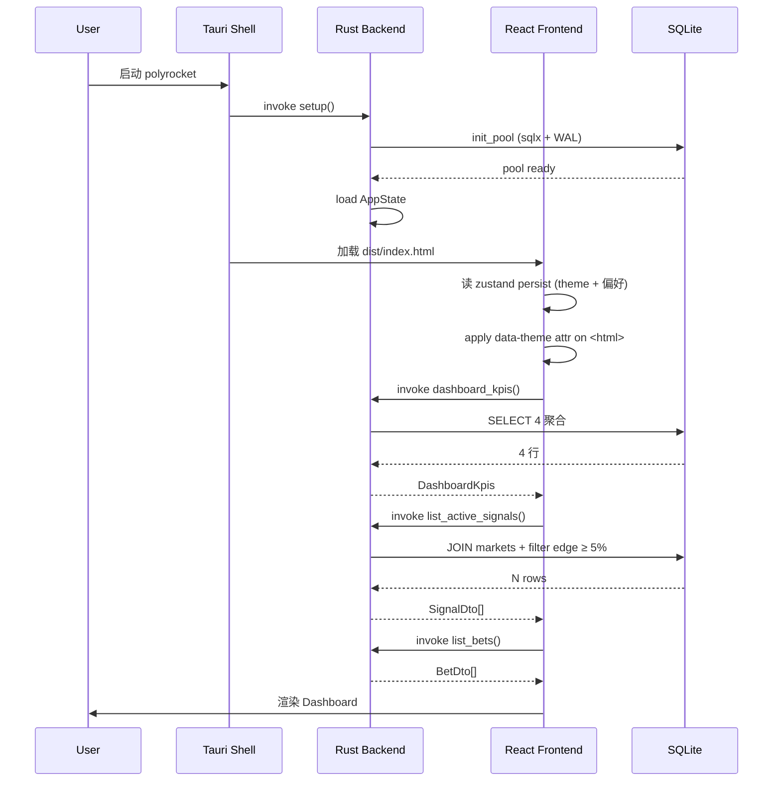
```mermaid
sequenceDiagram
    participant U as User
    participant T as Tauri Shell
    participant R as Rust Backend
    participant FE as React Frontend
    participant DB as SQLite

    U->>T: 启动 polyrocket
    T->>R: invoke setup()
    R->>DB: init_pool (sqlx + WAL)
    DB-->>R: pool ready
    R->>R: load AppState
    T->>FE: 加载 dist/index.html
    FE->>FE: 读 zustand persist (theme + 偏好)
    FE->>FE: apply data-theme attr on <html>
    FE->>R: invoke dashboard_kpis()
    R->>DB: SELECT 4 聚合
    DB-->>R: 4 行
    R-->>FE: DashboardKpis
    FE->>R: invoke list_active_signals()
    R->>DB: JOIN markets + filter edge ≥ 5%
    DB-->>R: N rows
    R-->>FE: SignalDto[]
    FE->>R: invoke list_bets()
    R-->>FE: BetDto[]
    FE->>U: 渲染 Dashboard
```

**关键约束**：
- 首屏必须在 500ms 内出现骨架屏，1.5s 内有数据
- 任何 IPC 失败回退到 mock data（已在 Dashboard.tsx 体现）

---

## F2 — 主题切换

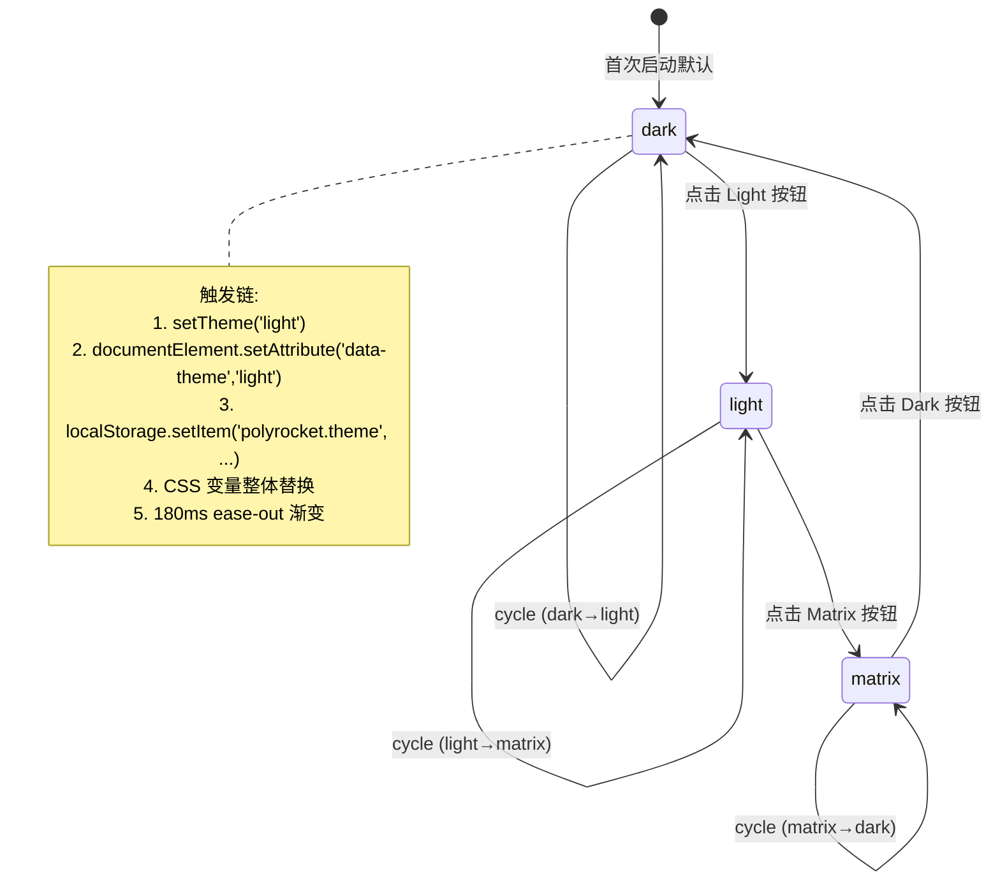
```mermaid
stateDiagram-v2
    [*] --> dark: 首次启动默认
    dark --> light: 点击 Light 按钮
    light --> matrix: 点击 Matrix 按钮
    matrix --> dark: 点击 Dark 按钮
    dark --> dark: cycle (dark→light)
    light --> light: cycle (light→matrix)
    matrix --> matrix: cycle (matrix→dark)

    note right of dark
        触发链:
        1. setTheme('light')
        2. documentElement.setAttribute('data-theme','light')
        3. localStorage.setItem('polyrocket.theme', ...)
        4. CSS 变量整体替换
        5. 180ms ease-out 渐变
    end note
```

**触发入口**：
- Sidebar 底部 Theme 按钮组（segmented control）
- 快捷键 `⌘⇧L`（规划中）

**持久化**：localStorage key `polyrocket.theme`（zustand persist middleware）

**约束**：
- **布局/字体/圆角/阴影/动效完全不变**（governance §11）
- 仅 CSS 变量替换

---

## F3 — 市场同步

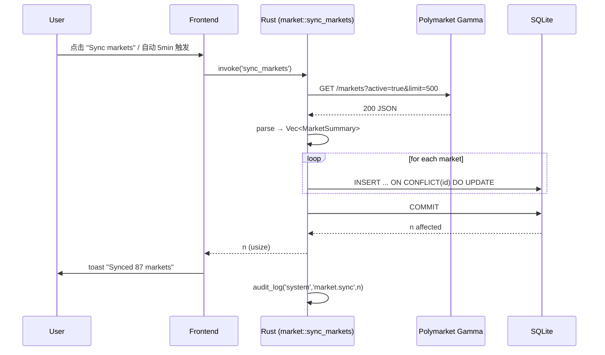
```mermaid
sequenceDiagram
    participant U as User
    participant FE as Frontend
    participant R as Rust (market::sync_markets)
    participant API as Polymarket Gamma
    participant DB as SQLite

    U->>FE: 点击 "Sync markets" / 自动 5min 触发
    FE->>R: invoke('sync_markets')
    R->>API: GET /markets?active=true&limit=500
    API-->>R: 200 JSON
    R->>R: parse → Vec<MarketSummary>
    loop for each market
        R->>DB: INSERT ... ON CONFLICT(id) DO UPDATE
    end
    R->>DB: COMMIT
    DB-->>R: n affected
    R-->>FE: n (usize)
    FE->>U: toast "Synced 87 markets"
    R->>R: audit_log('system','market.sync',n)
```

**错误处理**：
- 网络失败：保留本地 cache，toast 红色 "sync failed, using local cache"
- HTTP 429：指数退避重试 3 次（1s, 2s, 4s）
- 解析失败：跳过该条，记 audit_log('error:parse')

---

## F4 — 信号生成与展示

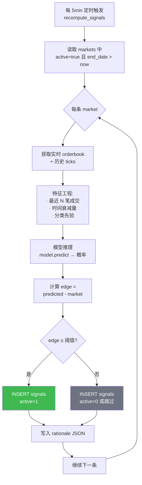
```mermaid
flowchart TD
    A[每 5min 定时触发<br/>recompute_signals] --> B[读取 markets 中<br/>active=true 且 end_date > now]
    B --> C{每条 market}
    C --> D[获取实时 orderbook<br/>+ 历史 ticks]
    D --> E[特征工程:<br/>· 最近 N 笔成交<br/>· 时间衰减量<br/>· 分类先验]
    E --> F[模型推理<br/>model.predict → 概率]
    F --> G[计算 edge =<br/>predicted - market]
    G --> H{edge ≥ 阈值?}
    H -->|是| I[INSERT signals<br/>active=1]
    H -->|否| J[INSERT signals<br/>active=0 或跳过]
    I --> K[写入 rationale JSON]
    J --> K
    K --> L[继续下一条]
    L --> C

    style I fill:#3FB950,color:#fff
    style J fill:#6E7382,color:#fff
```

**v0.1 简化**：signals 表由前端 mock 写入（M2 标 [MVP 简化]），model-lab 集成在 v0.2。

**展示过滤**：默认 |edge| ≥ 5%，可在 Settings 调整。

---

## F5 — 下单（Mode A 跳转）

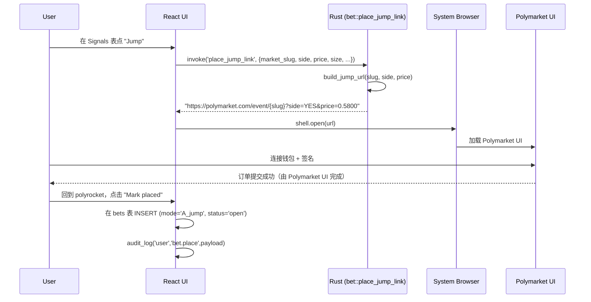
```mermaid
sequenceDiagram
    participant U as User
    participant FE as React UI
    participant R as Rust (bet::place_jump_link)
    participant Sh as System Browser
    participant PM as Polymarket UI

    U->>FE: 在 Signals 表点 "Jump"
    FE->>R: invoke('place_jump_link', {market_slug, side, price, size, ...})
    R->>R: build_jump_url(slug, side, price)
    R-->>FE: "https://polymarket.com/event/{slug}?side=YES&price=0.5800"
    FE->>Sh: shell.open(url)
    Sh->>PM: 加载 Polymarket UI
    U->>PM: 连接钱包 + 签名
    PM-->>U: 订单提交成功（由 Polymarket UI 完成）
    U->>FE: 回到 polyrocket，点击 "Mark placed"
    FE->>FE: 在 bets 表 INSERT (mode='A_jump', status='open')
    FE->>FE: audit_log('user','bet.place',payload)
```

**关键**：polyrocket **永远不持有用户私钥**，合规零风险。

---

## F6 — 下单（Mode B 签名）

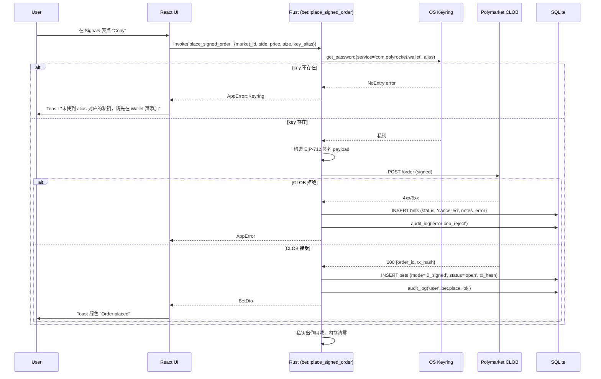
```mermaid
sequenceDiagram
    participant U as User
    participant FE as React UI
    participant R as Rust (bet::place_signed_order)
    participant KR as OS Keyring
    participant CLOB as Polymarket CLOB
    participant DB as SQLite

    U->>FE: 在 Signals 表点 "Copy"
    FE->>R: invoke('place_signed_order', {market_id, side, price, size, key_alias})
    R->>KR: get_password(service='com.polyrocket.wallet', alias)
    alt key 不存在
        KR-->>R: NoEntry error
        R-->>FE: AppError::Keyring
        FE->>U: Toast: "未找到 alias 对应的私钥，请先在 Wallet 页添加"
    else key 存在
        KR-->>R: 私钥
        R->>R: 构造 EIP-712 签名 payload
        R->>CLOB: POST /order (signed)
        alt CLOB 拒绝
            CLOB-->>R: 4xx/5xx
            R->>DB: INSERT bets (status='cancelled', notes=error)
            R->>DB: audit_log('error:cob_reject')
            R-->>FE: AppError
        else CLOB 接受
            CLOB-->>R: 200 {order_id, tx_hash}
            R->>DB: INSERT bets (mode='B_signed', status='open', tx_hash)
            R->>DB: audit_log('user','bet.place','ok')
            R-->>FE: BetDto
            FE->>U: Toast 绿色 "Order placed"
        end
    end
    R->>R: 私钥出作用域，内存清零
```

**安全要点**：
- 私钥**只在 Rust 进程内存**，绝不经过 IPC 边界到前端
- `keyring::set_password` 写 OS Keychain（macOS Keychain / Windows Cred Mgr / Linux Secret Service）
- 签名完成后立刻 drop 局部变量

**v0.1 状态**：审计日志写入路径已通；`place_signed_order` 内部返回 `Internal("not yet wired")`。完整实现需要 v0.2 引入 `rs-clob-client`。

---

## F7 — 订单结算与 P&L 记账

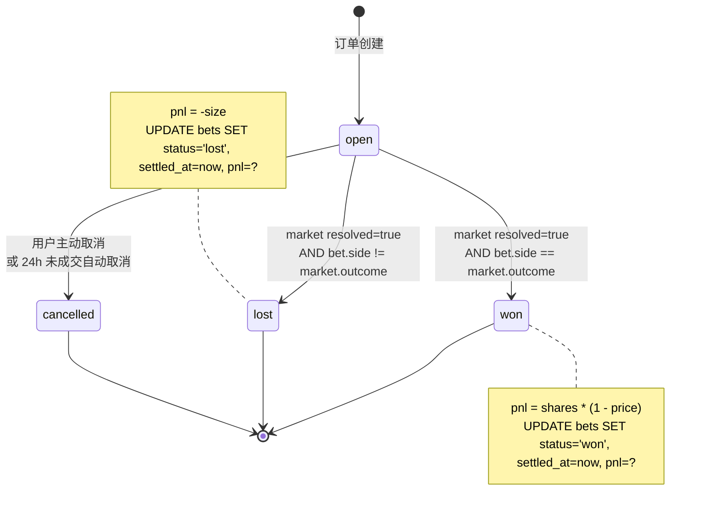
```mermaid
stateDiagram-v2
    [*] --> open: 订单创建
    open --> won: market resolved=true<br/>AND bet.side == market.outcome
    open --> lost: market resolved=true<br/>AND bet.side != market.outcome
    open --> cancelled: 用户主动取消<br/>或 24h 未成交自动取消
    won --> [*]
    lost --> [*]
    cancelled --> [*]

    note right of won
        pnl = shares * (1 - price)
        UPDATE bets SET status='won', settled_at=now, pnl=?
    end note

    note left of lost
        pnl = -size
        UPDATE bets SET status='lost', settled_at=now, pnl=?
    end note
```

**结算触发**：
- 主动：用户在 Bets 页点 "Settle now" 强制刷新
- 自动：每 60s 扫描 `markets.resolved=true` 且对应 `bets.status='open'` 的订单

**P&L 公式**：
- YES 方向：won → `shares * (1 - price)`；lost → `-size`
- NO 方向：won → `shares * price`；lost → `-size`

---

## F8 — 复制交易监控

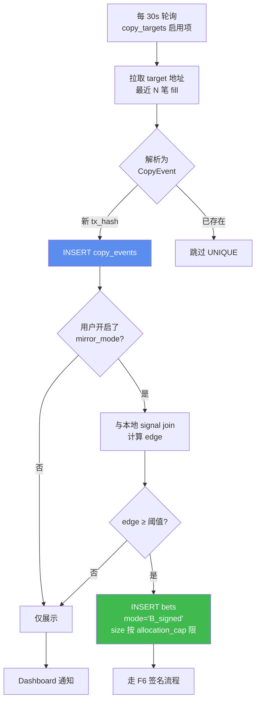
```mermaid
flowchart TD
    A[每 30s 轮询<br/>copy_targets 启用项] --> B[拉取 target 地址<br/>最近 N 笔 fill]
    B --> C{解析为<br/>CopyEvent}
    C -->|新 tx_hash| D[INSERT copy_events]
    C -->|已存在| E[跳过 UNIQUE]
    D --> F{用户开启了<br/>mirror_mode?}
    F -->|否| G[仅展示]
    F -->|是| H[与本地 signal join<br/>计算 edge]
    H --> I{edge ≥ 阈值?}
    I -->|否| G
    I -->|是| J[INSERT bets<br/>mode='B_signed'<br/>size 按 allocation_cap 限]
    J --> K[走 F6 签名流程]
    G --> L[Dashboard 通知]

    style D fill:#5B8DEF,color:#fff
    style J fill:#3FB950,color:#fff
```

**关键策略**：
- `tx_hash` UNIQUE 约束确保不重复处理
- `allocation_cap` 限制单笔最大金额
- `min_edge` 过滤信号

---

## F9 — 钱包与 keyring 管理

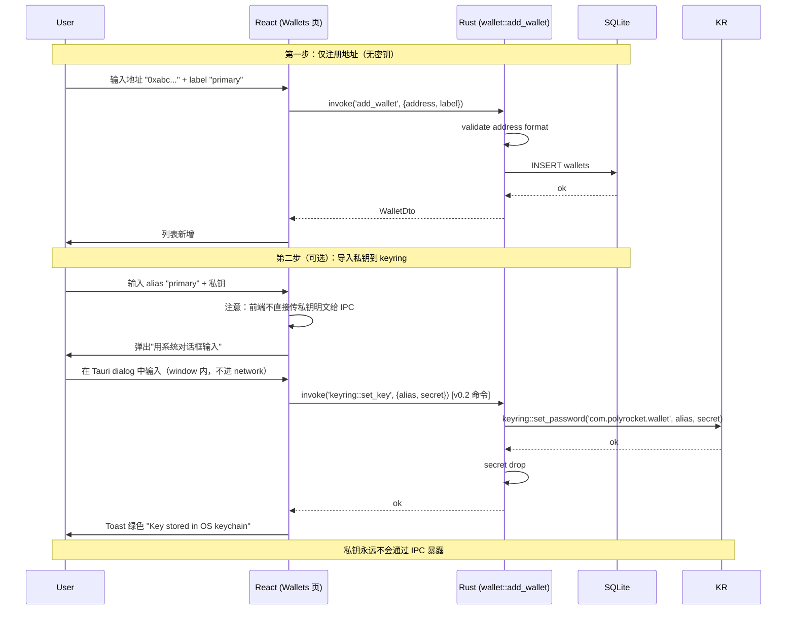
```mermaid
sequenceDiagram
    participant U as User
    participant FE as React (Wallets 页)
    participant R as Rust (wallet::add_wallet)
    participant DB as SQLite

    Note over U,DB: 第一步：仅注册地址（无密钥）
    U->>FE: 输入地址 "0xabc..." + label "primary"
    FE->>R: invoke('add_wallet', {address, label})
    R->>R: validate address format
    R->>DB: INSERT wallets
    DB-->>R: ok
    R-->>FE: WalletDto
    FE->>U: 列表新增

    Note over U,DB: 第二步（可选）：导入私钥到 keyring
    U->>FE: 输入 alias "primary" + 私钥
    FE->>FE: 注意：前端不直接传私钥明文给 IPC
    FE->>U: 弹出"用系统对话框输入"
    U->>FE: 在 Tauri dialog 中输入（window 内，不进 network）
    FE->>R: invoke('keyring::set_key', {alias, secret}) [v0.2 命令]
    R->>KR: keyring::set_password('com.polyrocket.wallet', alias, secret)
    KR-->>R: ok
    R->>R: secret drop
    R-->>FE: ok
    FE->>U: Toast 绿色 "Key stored in OS keychain"

    Note over U,KR: 私钥永远不会通过 IPC 暴露
```

**安全约束**（v0.2 设计）：
- 前端 UI 用 Tauri `dialog` 插件读取私钥（不在 webview 留下明文）
- `keyring::get_key` 只在 `place_signed_order` 内部调用，作用域最小化

---

## F10 — 模型性能追踪

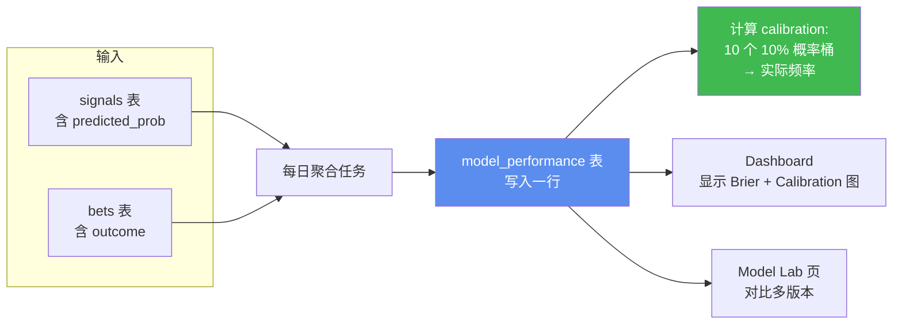
```mermaid
flowchart LR
    subgraph 输入
        S[signals 表<br/>含 predicted_prob]
        B[bets 表<br/>含 outcome]
    end

    S --> Agg[每日聚合任务]
    B --> Agg

    Agg --> MP[model_performance 表<br/>写入一行]

    MP --> Cal[计算 calibration:<br/>10 个 10% 概率桶<br/>→ 实际频率]

    MP --> UI[Dashboard<br/>显示 Brier + Calibration 图]
    MP --> Lab[Model Lab 页<br/>对比多版本]

    style MP fill:#5B8DEF,color:#fff
    style Cal fill:#3FB950,color:#fff
```

**聚合触发**：
- 每次 `recompute_signals` 完成后
- 每日 00:00 UTC 全量重算

**Brier Score 公式**：`mean((predicted - actual)^2)`

**Calibration JSON 格式**：
```json
{
  "buckets": [
    { "lo": 0.0, "hi": 0.1, "n": 12, "actual": 0.083 },
    { "lo": 0.1, "hi": 0.2, "n": 18, "actual": 0.167 },
    ...
  ]
}
```

---

## 跨流程主题：审计日志写入点

```
+─ F3 sync_markets → audit_log('system','market.sync',n)
+─ F5 bet place (manual confirm) → audit_log('user','bet.place','ok')
+─ F6 place_signed_order → audit_log('user','bet.place',payload)
+─ F7 settle → audit_log('system','bet.settle',{bet_id, status})
+─ F8 copy event → audit_log('system','copy.detect',{tx_hash})
+─ F8 mirror trigger → audit_log('system','copy.mirror',{bet_id})
+─ F9 add_wallet → audit_log('user','wallet.add',{address})
+─ F9 set_key → audit_log('user','key.set',{alias})
+─ F10 model_performance update → audit_log('system','model.update',{version})
+─ F11 llm_analyze → audit_log('user','llm.analyze',{providers, prompt_version})
+─ F12 llm_decision → audit_log('user','llm.decision',{user_decision, followed_llm_id})
+─ M9 update settings → audit_log('user','settings.update',payload)
```

---

## F11 — 多 LLM 并行分析（M10）

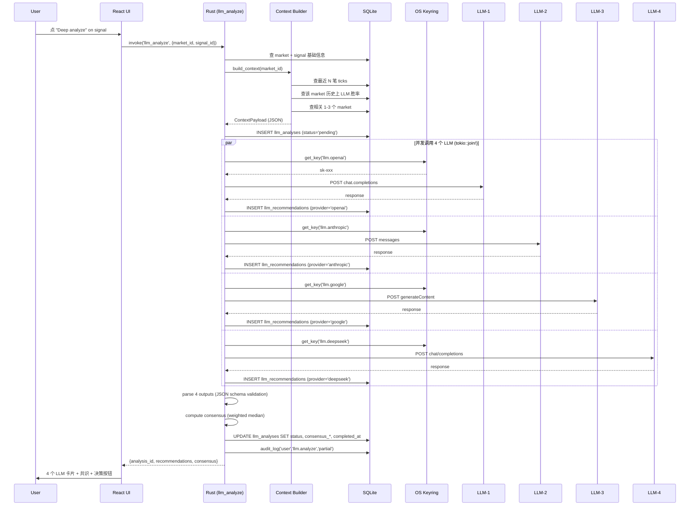
```mermaid
sequenceDiagram
    participant U as User
    participant FE as React UI
    participant R as Rust (llm_analyze)
    participant CTX as Context Builder
    participant DB as SQLite
    participant K as OS Keyring
    participant L1 as LLM-1
    participant L2 as LLM-2
    participant L3 as LLM-3
    participant L4 as LLM-4

    U->>FE: 点 "Deep analyze" on signal
    FE->>R: invoke('llm_analyze', {market_id, signal_id})
    R->>DB: 查 market + signal 基础信息
    R->>CTX: build_context(market_id)
    CTX->>DB: 查最近 N 笔 ticks
    CTX->>DB: 查该 market 历史上 LLM 胜率
    CTX->>DB: 查相关 1-3 个 market
    CTX-->>R: ContextPayload (JSON)
    R->>DB: INSERT llm_analyses (status='pending')

    par 并发调用 4 个 LLM (tokio::join!)
        R->>K: get_key('llm.openai')
        K-->>R: sk-xxx
        R->>L1: POST chat.completions
        L1-->>R: response
        R->>DB: INSERT llm_recommendations (provider='openai')
    and
        R->>K: get_key('llm.anthropic')
        R->>L2: POST messages
        L2-->>R: response
        R->>DB: INSERT llm_recommendations (provider='anthropic')
    and
        R->>K: get_key('llm.google')
        R->>L3: POST generateContent
        L3-->>R: response
        R->>DB: INSERT llm_recommendations (provider='google')
    and
        R->>K: get_key('llm.deepseek')
        R->>L4: POST chat/completions
        L4-->>R: response
        R->>DB: INSERT llm_recommendations (provider='deepseek')
    end

    R->>R: parse 4 outputs (JSON schema validation)
    R->>R: compute consensus (weighted median)
    R->>DB: UPDATE llm_analyses SET status, consensus_*, completed_at
    R->>DB: audit_log('user','llm.analyze','partial')
    R-->>FE: {analysis_id, recommendations, consensus}
    FE->>U: 4 个 LLM 卡片 + 共识 + 决策按钮
```

**关键点**：
- 产品层 prompt 完全在 Rust 端组装，**用户看不到**
- 4 个 LLM 并发跑，超时 30s/个
- 单个失败不影响其他 → `status='partial'`
- 每个推荐都持久化（含 raw_response 便于调优）

---

## F12 — 用户决策 + LLM 胜率统计

### F12.1 决策记录

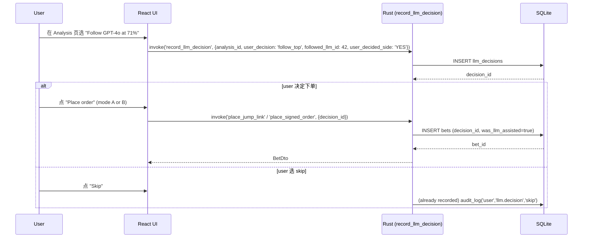
```mermaid
sequenceDiagram
    participant U as User
    participant FE as React UI
    participant R as Rust (record_llm_decision)
    participant DB as SQLite

    U->>FE: 在 Analysis 页选 "Follow GPT-4o at 71%"
    FE->>R: invoke('record_llm_decision', {analysis_id, user_decision: 'follow_top', followed_llm_id: 42, user_decided_side: 'YES'})
    R->>DB: INSERT llm_decisions
    DB-->>R: decision_id

    alt user 决定下单
        U->>FE: 点 "Place order" (mode A or B)
        FE->>R: invoke('place_jump_link' / 'place_signed_order', {decision_id})
        R->>DB: INSERT bets (decision_id, was_llm_assisted=true)
        DB-->>R: bet_id
        R-->>FE: BetDto
    else user 选 skip
        U->>FE: 点 "Skip"
        R->>DB: (already recorded) audit_log('user','llm.decision','skip')
    end
```

### F12.2 胜率统计

```mermaid
flowchart LR
    A[llm_recommendations<br/>recommended_side] --> J[sweep join on settled bets]
    B[bets<br/>settled_at, status, decision_id] --> J
    C[llm_decisions<br/>followed_llm_id] --> J
    J -->|where LLM.side = bet.side<br/>AND bet.status='won'| WR[per-LLM win rate]
    J -->|abs(LLM.predicted - actual)^2| B[per-LLM Brier]
    J -->|where user.followed LLM| UW[user-with-LLM win rate]
    J -->|where user skipped LLM| UM[user-without-LLM win rate]
    J -->|consensus: 3/4 agree| CW[consensus win rate]

    WR --> Perf[LLM Performance page]
    B --> Perf
    UW --> Perf
    UM --> Perf
    CW --> Perf

    style UW fill:#3FB950,color:#fff
    style UM fill:#F85149,color:#fff
```

**关键输出**（v0.2 `/llm-performance` 页面）：
| Provider | Win% | Brier | N | Cost |
|---|---|---|---|---|
| Claude Sonnet 4 | 71.2% | 0.118 | 23 | $1.20 |
| GPT-4o | 68.4% | 0.142 | 28 | $2.80 |
| Gemini 2.5 Pro | 65.0% | 0.156 | 19 | $0.80 |
| DeepSeek V3 | 61.1% | 0.184 | 17 | $0.10 |
| **Consensus (3/4)** | **73.5%** | **0.108** | **18** | - |
| User (followed LLM) | 70.1% | - | - | - |
| User (manual) | 55.0% | - | - | - |
| User (overrode LLM) | 52.4% | - | - | - |

**价值闭环**：用户能直观看到「跟 LLM 比独立判断多赚 18 个百分点」或「Claude 帮我赚钱 / GPT 帮我在亏」。

---

## F13 — LLM 投注结果多维统计（M10 v0.2 深化）

5 个切面 × 4 个视图的全交叉聚合。详细设计见 `polyrocket-llm-analysis.md §11`。

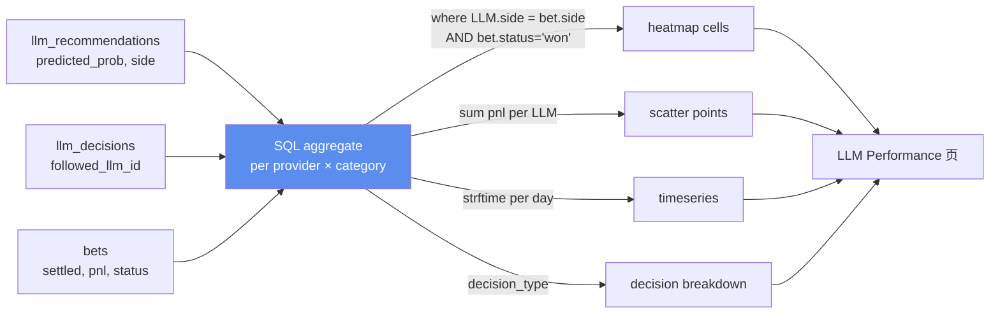
```mermaid
flowchart LR
    A[llm_recommendations<br/>predicted_prob, side] --> J[SQL aggregate<br/>per provider × category]
    B[llm_decisions<br/>followed_llm_id] --> J
    C[bets<br/>settled, pnl, status] --> J
    J -->|where LLM.side = bet.side<br/>AND bet.status='won'| WR[heatmap cells]
    J -->|sum pnl per LLM| SC[scatter points]
    J -->|strftime per day| TS[timeseries]
    J -->|decision_type| DC[decision breakdown]

    WR --> UI[LLM Performance 页]
    SC --> UI
    TS --> UI
    DC --> UI

    style J fill:#5B8DEF,color:#fff
```

**4 个 IPC**：
- `llm_stats_heatmap({provider_id?, category?, window_days?})`
- `llm_stats_scatter({window_days?})`
- `llm_stats_timeseries({window_days?})`
- `llm_stats_decision({window_days?})`

**核心 SQL 模式**（heatmap）：

```sql
SELECT r.provider_id, m.category,
       COUNT(b.id) AS n_evaluated,
       CAST(SUM(CASE WHEN b.status = 'won' AND r.side = b.side THEN 1 ELSE 0 END) AS REAL)
           / NULLIF(COUNT(b.id), 0) AS win_rate,
       AVG(CAST(b.pnl AS REAL)) AS avg_pnl
FROM llm_recommendations r
JOIN llm_decisions d ON d.followed_llm_id = r.id
JOIN bets b ON b.id = d.bet_id AND b.settled_at IS NOT NULL AND b.settled_at >= ?
JOIN markets m ON m.id = b.market_id
GROUP BY r.provider_id, m.category
```

**边界**：
- `n_evaluated < 5` → 隐藏胜率（避免小样本假象）
- 单笔 `pnl > 5σ` 不参与 avg_pnl（防极端值扭曲）
- 冷启动期（< 30 settled bets）显示「继续使用以收集数据」

---

## F14 — 每日看板自动分析（Daily Brief, M12）

详细设计见 `polyrocket-llm-analysis.md §12`。

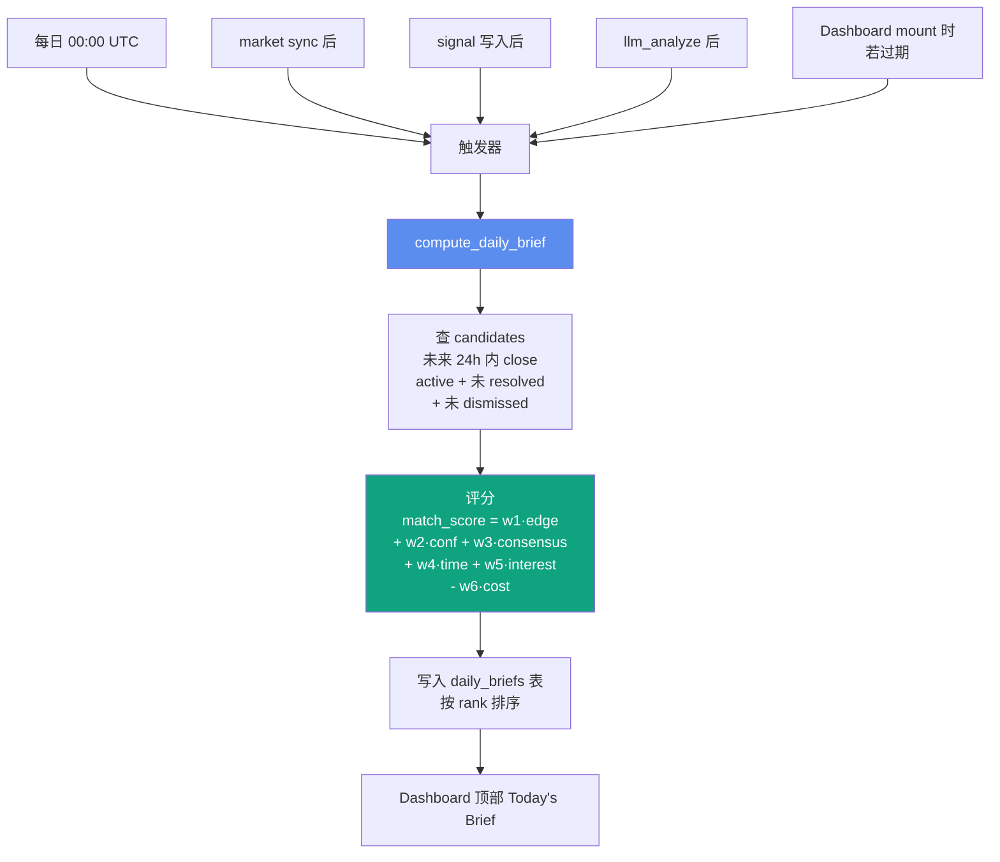
```mermaid
flowchart TD
    T[触发器] --> C[compute_daily_brief]
    R0[每日 00:00 UTC] --> T
    R1[market sync 后] --> T
    R2[signal 写入后] --> T
    R3[llm_analyze 后] --> T
    R4[Dashboard mount 时<br/>若过期] --> T

    C --> Q1[查 candidates<br/>未来 24h 内 close<br/>active + 未 resolved<br/>+ 未 dismissed]
    Q1 --> S[评分<br/>match_score = w1·edge<br/>+ w2·conf + w3·consensus<br/>+ w4·time + w5·interest<br/>- w6·cost]
    S --> W[写入 daily_briefs 表<br/>按 rank 排序]
    W --> UI[Dashboard 顶部 Today's Brief]

    style C fill:#5B8DEF,color:#fff
    style S fill:#10A37F,color:#fff
```

**评分公式**（默认权重，可在 Settings 调）：

```
match_score = 0.35·|edge| + 0.20·confidence + 0.20·consensus_strength
            + 0.15·time_decay + 0.10·user_interest - 0.10·cost_today
```

**数据源**：
- `markets` (end_date 24h, active, !dismissed) → 候选集
- `signals` (active, edge) → 量化信号
- `llm_analyses` (latest) → LLM 共识
- `markets.user_interested` → 用户兴趣加权
- `user_brief_prefs` → 个性化权重

**4 个 IPC**：
- `daily_brief_get({limit, max_items?})` — 拉今日 top N
- `daily_brief_dismiss(market_id)` — 标记 dismissed（24h 内不重推）
- `daily_brief_refresh()` — 强制重算
- `daily_brief_set_prefs({weights, max_items, min_liquidity, categories})`

**缓存策略**：
- `daily_briefs` 表带 `computed_at` + `expires_at`（=今日结束）
- 过期 / 24h 后自动重算
- 用户手动 dismiss 通过 `markets.brief_dismissed_at` 字段标记

---

## F15 — LLM 连通性测试（M11）

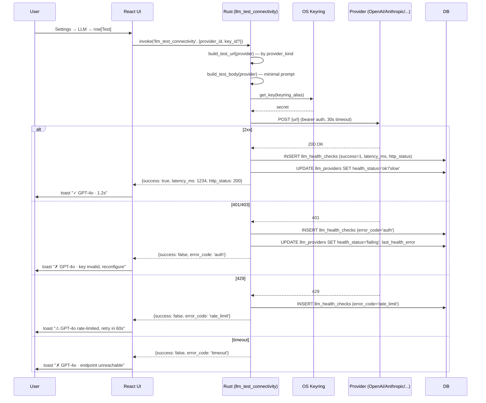
```mermaid
sequenceDiagram
    participant U as User
    participant FE as React UI
    participant R as Rust (llm_test_connectivity)
    participant K as OS Keyring
    participant API as Provider (OpenAI/Anthropic/...)

    U->>FE: Settings → LLM → row[Test]
    FE->>R: invoke('llm_test_connectivity', {provider_id, key_id?})
    R->>R: build_test_url(provider) — by provider_kind
    R->>R: build_test_body(provider) — minimal prompt
    R->>K: get_key(keyring_alias)
    K-->>R: secret

    R->>API: POST {url} (bearer auth, 30s timeout)
    alt 2xx
        API-->>R: 200 OK
        R->>DB: INSERT llm_health_checks (success=1, latency_ms, http_status)
        R->>DB: UPDATE llm_providers SET health_status='ok'/'slow'
        R-->>FE: {success: true, latency_ms: 1234, http_status: 200}
        FE->>U: toast "✓ GPT-4o · 1.2s"
    else 401/403
        API-->>R: 401
        R->>DB: INSERT llm_health_checks (error_code='auth')
        R->>DB: UPDATE llm_providers SET health_status='failing', last_health_error
        R-->>FE: {success: false, error_code: 'auth'}
        FE->>U: toast "✗ GPT-4o · key invalid, reconfigure"
    else 429
        API-->>R: 429
        R->>DB: INSERT llm_health_checks (error_code='rate_limit')
        R-->>FE: {success: false, error_code: 'rate_limit'}
        FE->>U: toast "⚠ GPT-4o rate-limited, retry in 60s"
    else timeout
        R-->>FE: {success: false, error_code: 'timeout'}
        FE->>U: toast "✗ GPT-4o · endpoint unreachable"
    end
```

**后台持续探针**（每 5min 一次，仅对 `enabled=1` 的 provider）：
- tokio::spawn interval task
- 同样写 `llm_health_checks` + 更新 `health_status` / `health_latency_p50/p95`
- 连续 3 次失败 → 临时 `enabled=0` + audit_log

---

## F16 — LLM 流量监控与异常告警（M11）

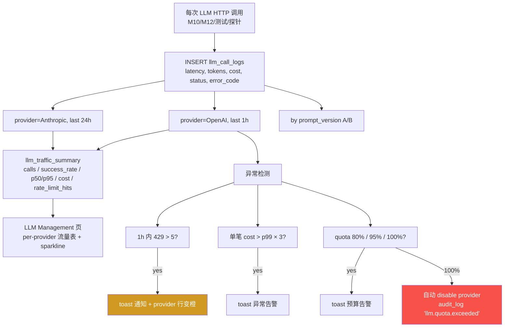
```mermaid
flowchart TD
    Call[每次 LLM HTTP 调用<br/>M10/M12/测试/探针] --> Log[INSERT llm_call_logs<br/>latency, tokens, cost, status, error_code]

    Log --> Q1[provider=OpenAI, last 1h]
    Log --> Q2[provider=Anthropic, last 24h]
    Log --> Q3[by prompt_version A/B]

    Q1 --> R[llm_traffic_summary<br/>calls / success_rate / p50/p95 / cost / rate_limit_hits]
    Q2 --> R
    R --> UI[LLM Management 页<br/>per-provider 流量表 + sparkline]

    Q1 --> A1[异常检测]
    A1 --> A2[1h 内 429 > 5?]
    A2 -->|yes| T1[toast 通知 + provider 行变橙]
    A1 --> A3[单笔 cost > p99 × 3?]
    A3 -->|yes| T2[toast 异常告警]
    A1 --> A4[quota 80% / 95% / 100%?]
    A4 -->|yes| T3[toast 预算告警]
    A4 -->|100%| Auto[自动 disable provider<br/>audit_log 'llm.quota.exceeded']

    style Auto fill:#F85149,color:#fff
    style T1 fill:#D29922,color:#fff
```

**关键指标**（per provider × window）：

| 指标 | 用途 |
|---|---|
| `calls_total / success / failed` | 容量规划 |
| `success_rate` | 健康度 |
| `avg_latency_ms / p95` | 性能追踪 |
| `total_tokens_in/out` | 用量审计 |
| `total_cost_cents` | 成本控制 |
| `rate_limit_hits` | 配额预警 |
| `delta_calls / delta_cost` | 异常增量 |

**8 个 IPC**（M11 全部）：

| IPC | 用途 |
|---|---|
| `llm_provider_list / upsert / delete` | Provider CRUD |
| `llm_key_list / upsert / delete` | Key CRUD（含多 key） |
| `llm_test_connectivity` | 一键连通性测试 |
| `llm_traffic_summary` | 流量聚合（1h/24h/30d） |
| `llm_health_history` | 健康历史（最近 100 条） |
| `llm_stats_by_confidence` | 按置信度分桶胜率 |
| `llm_stats_by_prompt` | 按 prompt 版本 A/B |
| `llm_stats_cost_efficiency` | 每 cent 换多少 P&L |
| `llm_stats_export` | 导出 CSV/JSON |

---

## F17 — 客户端密钥持久化（M11 v1.1 重点）

**设计原则**：API key **永远不入 SQLite、不入 .env、不入 git**。唯一受信任的存储是 OS keyring。两条写路径，client paste 是主路径，`.env` 仅开发。

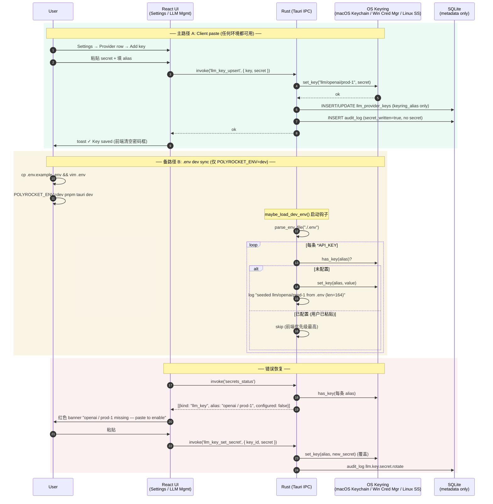
```mermaid
sequenceDiagram
    autonumber
    participant U as User
    participant FE as React UI<br/>(Settings / LLM Mgmt)
    participant R as Rust (Tauri IPC)
    participant K as OS Keyring<br/>(macOS Keychain / Win Cred Mgr / Linux SS)
    participant DB as SQLite<br/>(metadata only)

    rect rgba(0,200,100,0.08)
        Note over U,K: ── 主路径 A: Client paste (任何环境都可用) ──
        U->>FE: Settings → Provider row → Add key
        U->>FE: 粘贴 secret + 填 alias
        FE->>R: invoke('llm_key_upsert', { key, secret })
        R->>K: set_key("llm/openai/prod-1", secret)
        K-->>R: ok
        R->>DB: INSERT/UPDATE llm_provider_keys (keyring_alias only)
        R->>DB: INSERT audit_log (secret_written=true, no secret)
        R-->>FE: ok
        FE->>U: toast ✓ Key saved (前端清空密码框)
    end

    rect rgba(200,150,0,0.10)
        Note over U,K: ── 备路径 B: .env dev sync (仅 POLYROCKET_ENV=dev) ──
        U->>U: cp .env.example .env && vim .env
        U->>U: POLYROCKET_ENV=dev pnpm tauri dev
        Note over R: maybe_load_dev_env() 启动钩子
        R->>R: parse_env_file("./.env")
        loop 每条 *API_KEY
            R->>K: has_key(alias)?
            alt 未配置
                R->>K: set_key(alias, value)
                R->>R: log "seeded llm/openai/prod-1 from .env (len=164)"
            else 已配置 (用户已粘贴)
                R->>R: skip (前端优先级最高)
            end
        end
    end

    rect rgba(200,80,80,0.08)
        Note over FE,K: ── 错误恢复 ──
        FE->>R: invoke('secrets_status')
        R->>K: has_key(每条 alias)
        R-->>FE: [{kind: "llm_key", alias: "openai / prod-1", configured: false}]
        FE->>U: 红色 banner "openai / prod-1 missing — paste to enable"
        U->>FE: 粘贴
        FE->>R: invoke('llm_key_set_secret', { key_id, secret })
        R->>K: set_key(alias, new_secret) (覆盖)
        R->>DB: audit_log llm.key.secret.rotate
    end
```

**三条铁律**：
1. **client paste 永远胜出** — `.env` 启动同步只 fill 没配置的 alias，已存在的不覆盖。
2. **SQLite 永远不存 secret** — 所有 audit_log payload 只含 `secret_written: true/false`、长度、keyring alias 名。
3. **任何 IPC 返回值都不含 secret** — `secrets_status` 只返 `configured: bool`；`llm_key_*` 不返明文。

**keyring alias 命名空间**（lib.rs `keyring::` builders 统一产出，避免拼写漂移）：

```
llm/<provider_id>/<key_alias>          # LLM API key
polyrocket/pm/api                      # Polymarket CLOB API key
polyrocket/pm/secret                   # Polymarket CLOB secret
polyrocket/pm/passphrase               # Polymarket CLOB passphrase
polyrocket/wallet/<alias>              # 钱包私钥 (alias 默认 "primary")
```

**5 个新 IPC**：

| IPC | 用途 | 路径 |
|---|---|---|
| `llm_key_upsert { key, secret? }` | 新增/更新 key（含 secret） | A |
| `llm_key_set_secret { key_id, secret }` | rotate 已有 key 的 secret | A |
| `llm_key_delete { key_id }` | 删 row + 删 keyring | A |
| `llm_provider_delete { provider_id }` | 删 provider + 批量清 keyring 命名空间 | A |
| `llm_pm_set_credentials { api_key, secret, passphrase, host?, chain_id? }` | PM CLOB 三件套 | A |
| `llm_pm_clear_credentials` | 清 PM 三件套 | A |
| `polyrocket_wallet_set_pk { private_key, address, alias? }` | 写 wallet pk | A |
| `polyrocket_wallet_clear_pk { alias? }` | 清 wallet pk | A |
| `secrets_status` | 列出所有 secret 是否 configured（无明文） | A |

**启动门控**（lib.rs `maybe_load_dev_env`）：

```
POLYROCKET_ENV=dev && POLYROCKET_KEYRING_ONLY=0  → 读 .env
其他任何组合                                          → 跳过，client paste 是唯一路径
```

---

## F18 — 首启 Onboarding（M13 v2.0 新增）

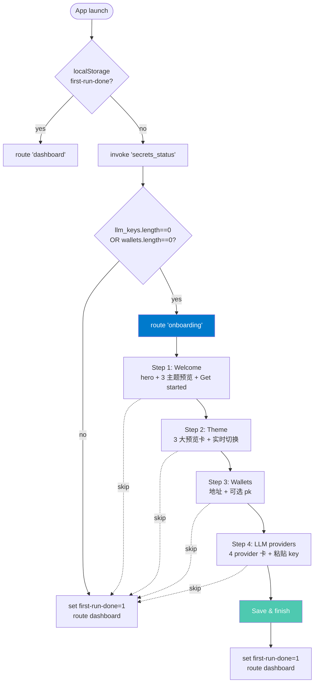
```mermaid
flowchart TD
    Start([App launch]) --> Check{localStorage<br/>first-run-done?}
    Check -->|yes| Dashboard[route 'dashboard']
    Check -->|no| Status[invoke 'secrets_status']
    Status --> Empty{llm_keys.length==0<br/>OR wallets.length==0?}
    Empty -->|no| Mark[set first-run-done=1<br/>route dashboard]
    Empty -->|yes| Onboard[route 'onboarding']
    Onboard --> Step1[Step 1: Welcome<br/>hero + 3 主题预览 + Get started]
    Step1 --> Step2[Step 2: Theme<br/>3 大预览卡 + 实时切换]
    Step2 --> Step3[Step 3: Wallets<br/>地址 + 可选 pk]
    Step3 --> Step4[Step 4: LLM providers<br/>4 provider 卡 + 粘贴 key]
    Step4 --> Submit[Save & finish]
    Submit --> Done[set first-run-done=1<br/>route dashboard]
    Step1 -.skip.-> Mark
    Step2 -.skip.-> Mark
    Step3 -.skip.-> Mark
    Step4 -.skip.-> Mark

    style Onboard fill:#007ACC,color:#fff
    style Submit fill:#4EC9B0,color:#fff
```

**关键约束**：
- 进度指示（顶部 4 dot）始终可见
- 任一步可「Skip for now」直接进 dashboard（保留 `first-run-done=0`，下次启动还会回 onboarding）
- 「Save & finish」写 `localStorage` + 跳 dashboard
- 真实环境：每步的 secret 走 client paste（参见 F17 主路径）

---

## F19 — Market Detail 钻取（M2 + M10 v2.0 新增）

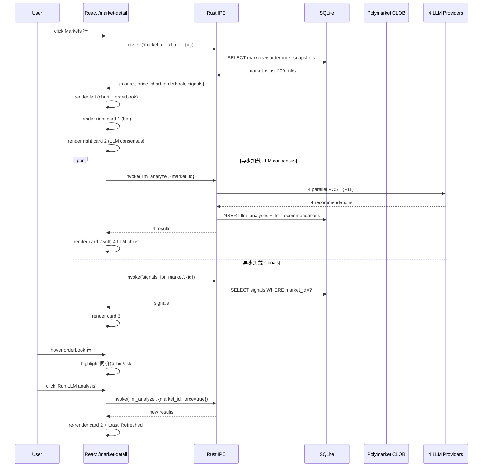
```mermaid
sequenceDiagram
    participant U as User
    participant FE as React /market-detail
    participant R as Rust IPC
    participant DB as SQLite
    participant PM as Polymarket CLOB
    participant LLM as 4 LLM Providers

    U->>FE: click Markets 行
    FE->>R: invoke('market_detail_get', {id})
    R->>DB: SELECT markets + orderbook_snapshots
    DB-->>R: market + last 200 ticks
    R-->>FE: {market, price_chart, orderbook, signals}
    FE->>FE: render left (chart + orderbook)
    FE->>FE: render right card 1 (bet)
    FE->>FE: render right card 2 (LLM consensus)

    par 异步加载 LLM consensus
        FE->>R: invoke('llm_analyze', {market_id})
        R->>LLM: 4 parallel POST (F11)
        LLM-->>R: 4 recommendations
        R->>DB: INSERT llm_analyses + llm_recommendations
        R-->>FE: 4 results
        FE->>FE: render card 2 with 4 LLM chips
    and 异步加载 signals
        FE->>R: invoke('signals_for_market', {id})
        R->>DB: SELECT signals WHERE market_id=?
        R-->>FE: signals
        FE->>FE: render card 3
    end

    U->>FE: hover orderbook 行
    FE->>FE: highlight 同价位 bid/ask
    U->>FE: click 'Run LLM analysis'
    FE->>R: invoke('llm_analyze', {market_id, force=true})
    R-->>FE: new results
    FE->>FE: re-render card 2 + toast 'Refreshed'
```

**3 张卡的占位策略**：
- card 1 (bet)：无异步，立即渲染
- card 2 (LLM consensus)：3-5s loading → render 4 provider chips
- card 3 (signals)：<500ms loading → render 4 indicator rows
- 任何异步失败 → 卡片显示 `uiError` + Retry 按钮，**不**阻塞其他 2 张

---

## F20 — Notifications Center（X2 v2.0 深化）

```mermaid
flowchart LR
    Event[Write op 触发<br/>IPC / cron / probe] --> Audit[audit_log INSERT]
    Audit --> Notif{event<br/>subscribed?}
    Notif -->|yes| Toast[toast 右下角<br/>3.5s 自动消失]
    Notif -->|yes| Persist[内存 ring buffer<br/>last 7 days]
    Toast --> Hover{user hover?}
    Hover -->|yes| Pause[暂停 leave timer]
    Hover -->|no| Leave[4s 后 fade out]
    Persist --> Center[/notifications page]
    Center --> Filter{filter kind?}
    Center --> Click{click row?}
    Click -->|yes| Jump[route 目标页面]
    Filter --> Mark[Mark all read]
    Mark --> Update[更新内存状态]

    style Toast fill:#10A37F,color:#fff
    style Center fill:#007ACC,color:#fff
```

**7 种 event kind × 颜色映射**：

| kind | icon | 颜色 | 触发 |
|---|---|---|---|
| `success` | check-circle-2 | var(--bull) | analyze complete、sync ok |
| `warn` | alert-triangle | var(--warning) | rate limit hit、quota 80% |
| `error` | x-circle | var(--bear) | auth fail、network error、db corruption |
| `info` | info | var(--accent) | signal fired、brief refreshed |
| `trade` | receipt | var(--bull/bear) | bet placed / won / lost |
| `system` | cog | var(--muted) | settings changed、model promoted |
| `key` | key-round | var(--warning) | key rotated、key missing |

**订阅偏好**（preferences modal）：每 kind 可独立开关 + 频率上限（如「rate limit 警告 1 小时内最多 3 条」）

---

## 变更日志

- **v1.5** (2026-06-16) — 新增 F18（首启 Onboarding 4 步）、F19（Market Detail 钻取：chart + orderbook + LLM + signals 三卡）、F20（Notifications Center 7 kind 订阅）。UI prototype 加 6 个新页面（Onboarding / Market Detail / Notifications / Help / Trade History / Audit Log）+ 完整 tokens / 状态机 / 动效 / a11y / Empty-Loading-Error 规范。
- **v1.6** (2026-06-16) — F11 真实化：4 provider 真 HTTP fan-out + key rotation + retry/backoff。5 个 provider client (OpenAI/Anthropic/Google/DeepSeek/Custom) + 8 错误码 + 3 prompt 模板。2 个新 IPC（llm_get_recommendation / llm_list_analyses）。
- **v1.7** (2026-06-16) — F21 (Health Probe + 3-fail auto-disable) + F22 (Daily Brief cron + 异常检测)。3 个 tokio loop + 3 个新 IPC（scheduler_status / scheduler_run_health_probe_now / scheduler_run_daily_brief_now）。
- **v1.4** (2026-06-16) — 新增 F17：客户端密钥持久化，明确 client paste 为主路径、.env 降级为 dev-only。9 个新 IPC，5 类 keyring 命名空间，启动门控 2 个 env flag。
- **v1.3** (2026-06-16) — 新增 F15（LLM 连通性测试）和 F16（流量监控 + 异常告警 + 12 IPC）。
- **v1.2** (2026-06-16) — 新增 F13（LLM 投注结果多维统计：5 维切面 + 4 视图 + 4 IPC）和 F14（每日看板：评分公式 + 触发机制 + 4 IPC + 缓存表）。
- **v1.1** (2026-06-16) — 新增 F11（多 LLM 并行分析）和 F12（用户决策 + LLM 胜率统计）。审计日志写入点 +2。
- **v1.0** (2026-06-16) — 初版。10 个核心流程，覆盖所有模块。