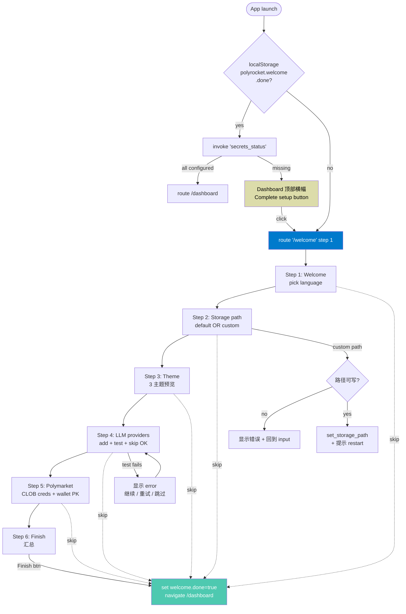

# polyrocket — First-run Landing Design (M13 v3)

> 版本：v1.0 · 2026-06-18 (v0.53 spec — first-run landing + storage picker)
> 配套：[`overview.md`](./overview.md)（5 层架构） · [`polyrocket-modules.md`](./polyrocket-modules.md)（M13 模块） · [`polyrocket-flows.md`](./polyrocket-flows.md)（F18 流程） · [`polyrocket-ui-design.md`](./polyrocket-ui-design.md)（5.13 页面设计）
> 状态：设计稿 — 待 v0.53 落地实现

---

## 0. 设计目标

polyrocket 当前（M13 v2.0）的 onboarding 是 4 步**描述性**引导（welcome → theme → wallet → LLM keys），每一步只展示一段说明 + 一个跳转到 /wallets 或 /llm-mgmt 的按钮。**没有真正收集凭据**，也没有让用户选择存储路径。用户首次打开应用，看到的 dashboard 是一个**空骨架**：没有 LLM 配过、没有 Polymarket 凭据、没有 wallet、数据库放在用户都不知道的 OS 默认目录里。

v0.53 要解决的 4 个真实问题：

1. **配置缺失即不可用**：打开应用时 Market Detail、Analysis、Trade 全部是 placeholder，但用户没有"先配好"的引导入口。从 MarketLab 也跳不进 Sign 模型版本，因为 prompt 调用 LLM 直接报错。
2. **存储位置不可见**：SQLite 写在 `~/Library/Application Support/com.polyrocket.app/`，日志在子目录 `logs/`。备份 / 迁移 / 跨设备同步 全靠用户自己找路径，毫无线索。
3. **凭据流转路径不透明**：用户在 /llm-mgmt 粘一个 key，看不到它写进了哪里。重构时容易在 dev .env / SQLite / 文件 三处复制凭据。
4. **首次体验缺乏连贯感**：当前 4 步里 LLM 是最后一步，但 LLM 才是大多数功能的前置依赖（Daily Brief、Analysis 都立刻调）。Step 排序不对。

## 1. 设计原则

| 原则 | 含义 |
|---|---|
| **One screen, one decision** | 每步只让用户做一个明确决定（选主题 / 选路径 / 粘 key）。**不**混合"主题+LLM+wallet"在一个长表单里。 |
| **Real actions, not descriptions** | 每步的"Next"按钮都触发真实的副作用（写设置 / 写 keyring / 写路径），不是只 set step + 1。 |
| **Skippable but loud** | 用户可跳到 dashboard，但 dashboard 顶部会持续显示"未完成配置"横幅 + 计数。跳过一次仍可在 Settings → "Re-run setup" 重启。 |
| **Secrets never leave the device** | 每一步显示"这条数据会写到 <OS keyring alias>，不会写到 SQLite 或任何文件"，强化用户信任。 |
| **Restart-aware** | 路径选择在下一次启动才生效（settings 表里的 `storage_path` 在 `init_pool` 之前读取）。UI 必须明确说明这一点。 |
| **Failure-recoverable** | LLM provider 测试连通性失败时不要把用户弹回步骤 1 — 在步骤内显示错误 + "继续 / 重试 / 跳过" 三个选项。 |

## 2. 入口与触发

### 2.1 启动门控

```ts
// src/main.tsx (L1)
const isFirstRun = localStorage.getItem('polyrocket.first-run-done') !== '1';
useEffect(() => {
  if (isFirstRun) {
    navigate('/welcome', { replace: true });
    return;
  }
  // 即便 first-run-done=1，仍然检查"半配置"状态：
  // 用户之前跳过了某些步骤，今天回来想补齐
  invoke('secrets_status').then((s) => {
    const needsLlm = s.llm_keys.length === 0;
    const needsPm = !s.polymarket.find((x) => x.kind === 'pm_api')?.configured;
    if (needsLlm || needsPm) {
      // 不强制跳转 — 在 Dashboard 顶部显示横幅
      queryClient.setQueryData(['welcome-banner'], { needsLlm, needsPm });
    }
  });
}, []);
```

**关键**：永远不强制跳转，但首次启动**自动**进 `/welcome`。之后用户在 Dashboard 顶部看到横幅时点 "Complete setup" 才再次进。

### 2.2 路径命名

旧 `/onboarding` 改名为 `/welcome`。理由：

- "Onboarding" 是 SaaS 术语，对桌面客户端用户太陌生
- "Welcome" 是 desktop 惯例（VS Code、Postman、Figma 都用 welcome / first-run）
- URL 也短：`polyrocket://welcome` 可以做 deep link（v0.54+）

旧 store `polyrocket.onboarding` 重命名为 `polyrocket.welcome`，schema 不变。

## 3. 6 步流程

### 步骤一览

| # | 步骤 | 用户决策 | 副作用（IPC） | 可跳过？ |
|---|---|---|---|---|
| 1 | **Welcome** | 选语言（默认从系统读） | `setLocale` | 否（必须进） |
| 2 | **Storage path** | 默认 / 自定义 | `setStoragePath` (新) | 是（保留默认） |
| 3 | **Theme** | 暗 / 亮 / Matrix | `setTheme` | 是 |
| 4 | **LLM providers** | 选 provider + 粘 key + 测连通 | `llmProviderUpsert` + `llmKeySetSecret` + `llmTestConnectivity` | 是（横幅提醒） |
| 5 | **Polymarket** | 粘 CLOB key/secret/passphrase + 可选 wallet pk | `llm_pm_set_credentials` + `polyrocket_wallet_set_pk` | 是（横幅提醒） |
| 6 | **Finish** | 看一眼汇总 → Finish | `setDone(true)` → dashboard | 否 |

每步的进度指示（顶部 6 dot 高亮当前）始终可见。

### 步骤 1：Welcome（hero）

**目标**：让用户知道这是什么，30 秒内决定是否继续。

布局（中央卡片，max-w 480px）：

```
┌──────────────────────────────────────────────┐
│                                              │
│              [rocket icon, 64px]             │
│                                              │
│           polyrocket — v0.53                 │
│                                              │
│   Polymarket analysis in your pocket.        │
│   Local-first, multi-LLM, OS keyring.       │
│                                              │
│   [跳过]                          [Get started] │
│                                              │
│   上次配置: 从未运行                          │
└──────────────────────────────────────────────┘
```

- 顶部语言选择器（zh / en / 后续扩展） — 默认从 `navigator.language` 读
- 跳过按钮 = `localStorage.first-run-done=1` + 直接进 dashboard（用户能在 Settings → Re-run setup 重启）
- "Get started" → step 2

### 步骤 2：Storage path

**目标**：让用户知道数据存在哪、能否迁移、能否改位置。

布局：

```
┌──────────────────────────────────────────────┐
│  Step 2 of 6 — Storage                        │
│                                              │
│  Where should polyrocket keep your data?     │
│                                              │
│  [ ● Use default ]                           │
│     ~/Library/Application Support/           │
│     com.polyrocket.app/                      │
│                                              │
│  [ ○ Pick a custom folder ]                  │
│     [ text input: /Users/me/polyrocket-data ] │
│     [ Browse... ]  (tauri-plugin-dialog)      │
│                                              │
│  Status: ✓ Directory writable, 12 GB free   │
│          ⚠ If you pick a custom path, it     │
│            takes effect on next launch.      │
│                                              │
│  This folder will hold:                      │
│  • polyrocket.db (your bets, signals,        │
│    models, audit log)                        │
│  • logs/ (Tauri + scheduler)                 │
│  • logs/telemetry/ (opt-in lifecycle events) │
│  NO secrets — those live in OS keyring only.│
│                                              │
│                       [Back] [Next]          │
└──────────────────────────────────────────────┘
```

- 默认单选 = 用 OS 推荐路径（macOS `~/Library/Application Support/com.polyrocket.app/`、Win `%APPDATA%`、Linux `~/.local/share/com.polyrocket.app/`）
- 自定义单选 = 显示 `<input>` + `Browse...`（调 `tauri-plugin-dialog::DialogExt::dialog().file().pick_folder()`）
- 状态实时校验：路径必须存在 + 可写 + 至少有 1 GB 剩余空间（用 `std::fs::metadata` + `statvfs` / `GetDiskFreeSpaceEx`）
- "Next" 调 `setStoragePath(path)`（首次默认路径下不写 settings，复用 OS 默认）；自定义路径写 `storage_path` key

### 步骤 3：Theme

**目标**：让 3 主题差异肉眼可见（不只颜色不同）。

布局（3 列等宽 card，每张 = 大预览 + 描述 + 选 / 已选状态）：

```
┌──────────────────────────────────────────────┐
│  Step 3 of 6 — Theme                          │
│                                              │
│  Pick a look. You can change this anytime.   │
│                                              │
│  ┌──────────┐  ┌──────────┐  ┌──────────┐    │
│  │ Dark     │  │ Light    │  │ Matrix   │    │
│  │ [preview]│  │ [preview]│  │ [preview]│    │
│  │ Cursor-  │  │ Clean &  │  │ Green-   │    │
│  │ style    │  │ bright   │  │ on-black │    │
│  │          │  │          │  │          │    │
│  │    ✓     │  │          │  │          │    │
│  └──────────┘  └──────────┘  └──────────┘    │
│                                              │
│                       [Back] [Next]          │
└──────────────────────────────────────────────┘
```

预览图 80×60 SVG，渲染 1 行 nav + 1 行 KPI 卡的简化版（每个主题 1 张）。CSS 用 `data-theme` attribute 切换，整页立刻换色 — 让用户立刻看到对比。

### 步骤 4：LLM providers（重点）

**目标**：让用户**真实粘贴**至少 1 个 provider key，**实时看到**写入成功 + 连通性测试结果。

布局：

```
┌──────────────────────────────────────────────┐
│  Step 4 of 6 — LLM providers                  │
│                                              │
│  You need at least one LLM provider for       │
│  Analysis, Daily Brief, and LLM-assisted     │
│  signals. Add as many as you like.            │
│                                              │
│  ── Provider ────────────────────────────    │
│  [● OpenAI  ○ Anthropic  ○ Google  ○ DeepSeek │
│   ○ Custom (OpenAI-compatible)              ]│
│                                              │
│  ── Alias (human-readable name) ────────    │
│  [ openai-prod-1_______________________ ]    │
│                                              │
│  ── API key ──────────────────────────────   │
│  [ •••••••••••••••••••••••••••••• ]          │
│       paste — keyring alias preview:          │
│       polyrocket/llm/openai/openai-prod-1    │
│                                              │
│  [ Test connectivity ]   (btn)                │
│                                              │
│  ✓ Latency 423ms, model: gpt-4o-mini          │
│  ⚠ Latency timeout (>10s)                    │
│                                              │
│  ── Added keys ───────────────────────────    │
│  ✓ openai-prod-1  (just added, latency 423ms) │
│  ✓ openai-backup   (added v0.6, latency 891ms)│
│                                              │
│  [ + Add another provider ]                   │
│                                              │
│  ──────────────────────────────────────────── │
│  Keys are stored in OS keyring only.         │
│  polyrocket.db has labels + priorities,      │
│  never the secret string.                    │
│                                              │
│           [Skip]   [Back]   [Next]            │
└──────────────────────────────────────────────┘
```

**关键 IPC 调用顺序**（每加一个 key）：

```
1. llmProviderUpsert({provider_id, alias, priority, base_url})
   → 创建 llm_provider_keys 行（label + priority + base_url）
2. llmKeySetSecret({key_id, secret})
   → 写 OS keyring 'polyrocket/llm/{provider}/{alias}'
3. llmTestConnectivity({key_id})
   → 用 key 调 provider 的 /v1/models 或 /health
   → 返回 {ok, latency_ms, model, error}
```

**Test connectivity 失败时**不阻塞 — 用户可点 Next 跳过已成功添加的 key。下次启动 / Settings → LLM Mgmt 可重试。

**Next 按钮状态**：始终可点（用户可没加任何 key 就跳过，dashboard 顶部横幅提醒）。

### 步骤 5：Polymarket

**目标**：让用户粘 Polymarket CLOB 凭据 + 可选 wallet 私钥。**强调安全：先粘后写 keyring，可视化 keyring alias**。

布局（2 个 card 堆叠）：

```
┌──────────────────────────────────────────────┐
│  Step 5 of 6 — Polymarket                     │
│                                              │
│  ┌── CLOB API credentials ────────────────┐  │
│  │ Polymarket uses 3 fields for CLOB      │  │
│  │ authentication. Get them at             │  │
│  │ polymarket.com/settings → API keys.     │  │
│  │                                         │  │
│  │ API key      [ •••••••••••• ]           │  │
│  │ API secret   [ •••••••••••• ]           │  │
│  │ Passphrase   [ •••••••••••• ]           │  │
│  │                                         │  │
│  │ Keyring aliases:                        │  │
│  │  polyrocket/pm/api                       │  │
│  │  polyrocket/pm/secret                    │  │
│  │  polyrocket/pm/passphrase                │  │
│  │                                         │  │
│  │ [ Test with a fake order ]              │  │
│  │  ✓ Connected (latency 612ms)             │  │
│  │  ⚠ 401 Unauthorized (check spelling)     │  │
│  │                                         │  │
│  │ [ Skip for now ]  [ Save credentials ]  │  │
│  └─────────────────────────────────────────┘  │
│                                              │
│  ┌── Trading wallet (optional) ────────────┐  │
│  │ For mode-B signed bets you'll need a   │  │
│  │ Polygon wallet. Address-only mode-A     │  │
│  │ bets work without one.                  │  │
│  │                                         │  │
│  │ Wallet address  [ 0x...________________ ] │  │
│  │ Private key      [ •••••••••••••• ]     │  │
│  │  (stored under polyrocket/wallet/primary)│  │
│  │                                         │  │
│  │ ⚠ Never paste a key you can't afford    │  │
│  │   to lose. polyrocket never transmits    │  │
│  │   secrets anywhere.                     │  │
│  │                                         │  │
│  │ [ Skip for now ]  [ Add wallet ]         │  │
│  └─────────────────────────────────────────┘  │
│                                              │
│           [Back]   [Skip]   [Next]            │
└──────────────────────────────────────────────┘
```

**关键 IPC 调用**：

```
1. llm_pm_set_credentials({api_key, api_secret, api_passphrase})
   → 校验非空 + 3 个字段写 keyring
   → 写 _polyrocket_settings 表 pm_host / pm_chain_id（如果有）
2. polyrocket_wallet_set_pk({private_key, address, alias})
   → 校验 64 hex chars
   → 写 keyring polyrocket/wallet/{alias}
   → 写 wallets 行（address / label / keyring_alias）
```

**Skip 按钮**：用户可跳过 Polymarket 凭据（很多用户只用 mode-A 跳转 URL，不需要 keyring 里的 secret）。Dashboard 横幅会显示"Polymarket 凭据未配，bet 用 mode-A 跳转"。

### 步骤 6：Finish（汇总）

**目标**：让用户看到"我刚做了什么"，给心理闭环。

```
┌──────────────────────────────────────────────┐
│  Step 6 of 6 — You're set up                  │
│                                              │
│  ✓ Language: 中文                              │
│  ✓ Theme: Dark                                 │
│  ✓ Storage: ~/Library/Application Support/   │
│             com.polyrocket.app/ (default)     │
│  ✓ LLM: OpenAI / openai-prod-1                │
│         (latency 423ms, model gpt-4o-mini)    │
│  ✓ Polymarket: CLOB connected (612ms)         │
│  ✓ Wallet: 0x1234…5678 (primary)               │
│                                              │
│  Skip these for now:                          │
│  • 0 backup keys added                         │
│  • 0 additional LLM providers                 │
│                                              │
│  polyrocket will start syncing markets on     │
│  launch. First sync takes 10-30s.             │
│                                              │
│              [ Back to dashboard ]            │
└──────────────────────────────────────────────┘
```

**Finish 按钮**写 `localStorage.polyrocket.first-run-done=1` + 跳 `/dashboard`。

## 4. 数据模型

### 4.1 localStorage（L1）

```ts
interface WelcomeState {
  done: boolean;         // 写 1 后再启动就不再进 /welcome
  step: number;          // 0..5，当前停留步骤
  locale?: string;       // 用户选的；不写则用 navigator.language
  setDone: (b: boolean) => void;
  setStep: (s: number) => void;
  setLocale: (l: string) => void;
}
```

Storage key: `polyrocket.welcome`（旧 `polyrocket.onboarding` 一次性迁移 — 读取时 if old key present, copy to new, delete old）。

### 4.2 settings 表（L4）

新增 1 行 key：

```sql
INSERT OR REPLACE INTO _polyrocket_settings (k, v) VALUES
  ('storage_path', '/Users/me/polyrocket-data');
```

`storage_path` 为 NULL 或文件不存在 → fallback 到 `app_data_dir()`。读取逻辑在 `infra::db::pool::init_pool` 之前。

### 4.3 LLM provider key 行（已有 schema）

`llm_provider_keys` 表不变。Landing 调 `llmProviderUpsert` 即可，复用 v0.5d 的 IPC。

### 4.4 wallet 行（已有 schema）

`wallets` 表不变。Landing 调 `polyrocket_wallet_set_pk`（v0.5d）即可。

## 5. IPC 设计

### 5.1 现有 IPC 复用

| IPC | 用途 | 调用方 |
|---|---|---|
| `secrets_status` | 返回当前 llm_keys / polymarket / wallets 状态 | step 6 汇总 |
| `llm_provider_upsert` | 创 / 更新 provider 行 | step 4 |
| `llm_key_set_secret` | 写 keyring | step 4 |
| `llm_test_connectivity` | 测 latency | step 4 |
| `llm_pm_set_credentials` | 写 CLOB 三件套 | step 5 |
| `polyrocket_wallet_set_pk` | 写 wallet keyring + wallets 行 | step 5 |
| `set_theme` | 已存在（L1 store 直调） | step 3 |

### 5.2 新 IPC（3 个）

```rust
// commands::storage.rs (NEW)
#[derive(Debug, Serialize)]
pub struct StorageInfo {
    pub default_path: String,        // ~/Library/Application Support/...
    pub current_path: String,        // 用户当前选的实际路径
    pub is_custom: bool,             // current != default
    pub exists: bool,                // 路径是否在磁盘上
    pub writable: bool,              // 当前用户能否写
    pub free_bytes: Option<u64>,     // 可用空间
}

#[tauri::command]
pub async fn get_storage_info() -> AppResult<StorageInfo> { ... }

#[derive(Debug, Deserialize)]
pub struct SetStoragePathArgs {
    pub path: String,
}

#[tauri::command]
pub async fn set_storage_path(args: SetStoragePathArgs) -> AppResult<()> {
    // 1. 校验路径存在 + 可写
    // 2. 写 _polyrocket_settings: storage_path = path
    // 3. 创建 <path>/logs 子目录
    // 4. 写 audit_log（actor=user, action=storage.path.set）
    // 注意：实际生效是 NEXT launch —— 当前进程的 db 已经打开
}

#[tauri::command]
pub async fn reset_storage_path() -> AppResult<()> {
    // 删 _polyrocket_settings: storage_path 行
    // 下次启动用默认
}
```

### 5.3 路径读取（infra/db/pool.rs 启动逻辑）

```rust
pub async fn resolve_db_path(app: &AppHandle) -> AppResult<PathBuf> {
    let default = paths::db_path(app)?;  // 旧的 app_data_dir 路径
    let custom = settings::get("storage_path", &pool).await.ok().flatten();
    match custom {
        Some(p) if std::path::Path::new(&p).exists() => Ok(PathBuf::from(p)),
        _ => Ok(default),
    }
}
```

`init_pool` 改为接受 resolved path，而不是直接从 `app_data_dir` 算。`log_dir` 同理。

**重启要求**：UI 必须在 `set_storagePath` 成功后提示"This change takes effect on next launch. Please restart polyrocket to apply." 加按钮 [Restart now] 调 `app_handle.restart()`（Tauri 2 的 `Manager::restart`）。

## 6. UI / 视觉

### 6.1 布局模板（每步）

```
┌─────────────────────────────────────────────────┐
│  ●─●─●─○─○─○   Step 3 of 6 — Theme            │
├─────────────────────────────────────────────────┤
│                                                 │
│   <step content>                                │
│                                                 │
├─────────────────────────────────────────────────┤
│   [< Back]                  [Skip]   [Next >]   │
└─────────────────────────────────────────────────┘
```

- 进度条：6 个 dot + 连接线，已完成的 dot 实色，当前 dot 外圈 accent
- 卡片宽度 `max-w-3xl`（1040px），居中
- 整体高度 `min-h-screen`，垂直居中
- 主题切换时整页实时换色（CSS `data-theme` 在 `<html>` 上）

### 6.2 各主题预览图

每张主题卡片顶部 80×60 SVG 迷你预览：

```
┌─ mini preview ─────────────────────┐
│ ▢ Dashboard  ▢ Markets  ▢ Signals  │  ← nav row
│ ───────────────────────────────────│
│ ┌────────┐  ┌────────┐  ┌────────┐ │  ← KPI tiles
│ │ Total  │  │ Open   │  │ Win    │ │
│ │ 12.5k  │  │ 234    │  │ 64%    │ │
│ └────────┘  └────────┘  └────────┘ │
└────────────────────────────────────┘
```

每个主题渲染自己的配色，整页 live preview。

### 6.3 跳过 vs 完成的视觉差

- **完成步**：dot 实色 + step 标题显示 ✓
- **跳过步**：dot 半色 + step 标题显示 "—" + Next 按钮文案不变（不区分跳过 vs 完成）

Dashboard 横幅（半配置状态）：

```
┌─────────────────────────────────────────────────┐
│ ⚠ Setup incomplete — 2 of 4 secrets missing     │
│   • LLM providers: 0 keys configured            │
│   • Polymarket CLOB: not configured              │
│                                       [ Complete ] │
└─────────────────────────────────────────────────┘
```

点击 "Complete" → 跳 `/welcome` 的最后未完成步骤（不重置已完成的）。

## 7. Flow 图



## 8. 与现有 docs 的关系

| 文档 | 改什么 |
|---|---|
| `overview.md` | 顶部版本号 v2.14 → v2.15（v0.53 spec）；overview 加一行 5.13 加 v0.53 |
| `polyrocket-modules.md` | M13 章节重写：原"4 步描述性"改"6 步真操作"；表格里 M13 行加 sub-version |
| `polyrocket-flows.md` | F18 mermaid 流程图重画（6 步 + 跳过路径 + 横幅回流） |
| `polyrocket-ui-design.md` | 5.13 Onboarding 整章替换：layout + 各步骤截图描述 + keyring alias 显示规则 |

每个文档的更新都在 v0.53d 的 ship commit 里完成。

## 9. 测试矩阵

| 测试 | 类型 | 关键断言 |
|---|---|---|
| `welcome.done=false` 启动 → 跳 `/welcome` | 集成 (vitest) | localStorage 未设 → navigate('/welcome', {replace:true}) |
| `welcome.done=true` 启动 → 不强制跳 | 集成 | localStorage=1 → 不 navigate |
| Step 4 添加 OpenAI key → keyring 有 1 个 | cargo | mock keyring::set_key 调用 |
| Step 4 连通性失败 → 不阻塞 Next | cargo + vitest | test_connectivity 返回 err → 按钮仍可点 |
| Step 5 skip → wallets 表 0 行，PM 不写 keyring | cargo | skip path 不调任何写 IPC |
| setStoragePath 写 invalid 路径 → AppError::Invalid | cargo | path='/nonexistent/foo' → 校验失败 |
| resetStoragePath → settings 表 storage_path 删 | cargo | 调 reset 后 get_storage_info().is_custom=false |
| 旧 `polyrocket.onboarding` key 一次性迁移 | vitest | 启动时 if old key, copy & delete |
| Dashboard 横幅：llm=0 显示 | vitest | secrets_status mock 返回 0 → 横幅 in DOM |
| 完成 6 步后再次启动 → 不进 /welcome | 集成 | localStorage=1 + secrets 都有 |

## 10. 范围与不做的事

**不在 v0.53 做**（推迟到 v0.54+）：

- tauri-plugin-dialog 当前 Tauri 项目**没有**这个插件。v0.53 不引入新 Cargo 依赖 — 用 `<input type="text">` 让用户**手动粘贴路径**。`Browse...` 按钮等 v0.54 加 dialog 插件时再上。
- LLM provider 的 `base_url` 配置（自定义 endpoint URL）— 留 v0.54，CUSTOM provider 默认 `https://api.openai.com/v1`。
- 路径迁移工具（"copy existing db to new path"）— v0.54 candidate。
- 多 wallet alias 引导（add primary + secondary 一次性）— 留 Settings → Wallets 页面。
- 国际化：landing UI 默认 zh/en 双语，文案 i18n keys 都进 i18n.ts。
- 完成后的"开始 30 秒教程" overlay — v0.54+ UX。

## 11. 文件改动预告（v0.53 落地后）

```
src-tauri/src/commands/storage.rs           | NEW — get/set/reset_storage_*
src-tauri/src/commands/mod.rs               | +storage 模块
src-tauri/src/platform/paths.rs             | resolve_db_path / resolve_log_dir
src-tauri/src/infra/db/pool.rs              | init_pool 接受 resolved path
src-tauri/src/lib.rs                        | +3 invoke_handler entries
src-tauri/Cargo.toml                        | (no new deps in v0.53)
src/ipc.ts                                  | +StorageInfo type + 3 wrappers
src/types/welcome.ts                        | NEW — WelcomeState type
src/stores/welcome-store.ts                 | NEW — zustand + persist
src/stores/welcome-store.test.ts            | 旧 key 迁移测试
src/routes/Welcome.tsx                      | NEW — 6 步 wizard
src/routes/Welcome.test.tsx                 | NEW — 集成测试
src/components/welcome/StepProgress.tsx     | NEW — 6 dot progress
src/components/welcome/StoragePathStep.tsx  | NEW
src/components/welcome/ThemeStep.tsx        | NEW
src/components/welcome/LlmStep.tsx          | NEW
src/components/welcome/PolymarketStep.tsx   | NEW
src/components/welcome/FinishStep.tsx       | NEW
src/components/feedback/WelcomeBanner.tsx   | NEW — 半配置横幅
src/lib/i18n.ts                             | +30 keys × 2 locales
docs/polyrocket-landing-design.md           | (this file)
docs/overview.md                            | v2.14 → v2.15
docs/polyrocket-modules.md                  | M13 重写
docs/polyrocket-flows.md                    | F18 mermaid 重画
docs/polyrocket-ui-design.md                | 5.13 整章替换
```

预计：~14 新文件 + 8 改文件，+1500 LOC，+10 cargo 测试，+5 vitest 测试。
