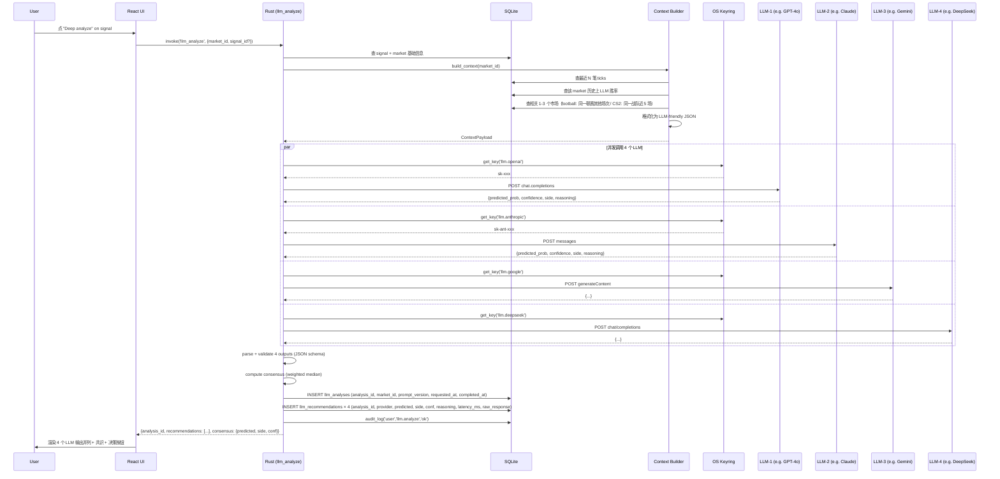
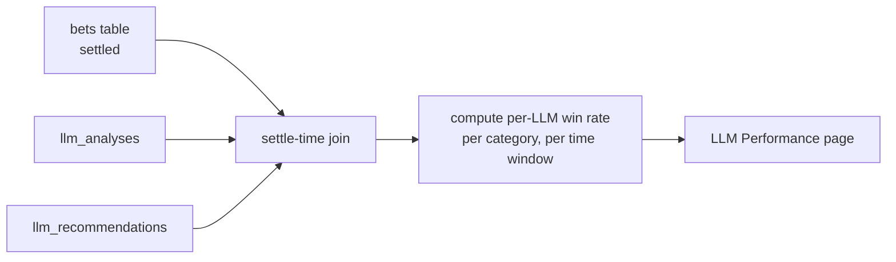

# polyrocket — LLM 多模型分析业务设计

> 版本：v1.0 · 2026-06-16
> 配套：[`polyrocket-modules.md`](./polyrocket-modules.md) · [`polyrocket-flows.md`](./polyrocket-flows.md) · [`polyrocket-ui-design.md`](./polyrocket-ui-design.md)
> 模块代号：**M10 — LLM Analysis**
> 状态：v0.2 路线（v0.1 不包含此模块，仅做数据层预留）

---

## 0. 背景与目标

### 0.1 为什么需要 LLM

polyradar 现有的 `signals` 表是**单一模型输出**（v0.3.2）。这种模式有 3 个局限：

1. **单点故障**：模型 bug / 训练数据过时 / 超参不适配 → 整个 signals 列表失真
2. **没有"思考过程"**：predicted_prob 是个数字，用户**不知道为什么**是这个数字
3. **没有自然语言洞察**：CS2 战队的近 5 场状态、球员伤情这种**非结构化信息**模型用不上

LLM 能补这两块：自然语言推理 + 多视角。但 LLM **不能做实时市场数据采集和量化模型**（这是 polyrocket 数据层的事）。

### 0.2 产品层做 prompt 工程（约束）

**用户在产品内只看到「上下文卡片 + 模型输出 + 决策按钮」，看不到原始 prompt。** 这是有意的设计选择：

| 角色 | 看到什么 |
|---|---|
| 用户 | 结构化的 market 上下文卡 + 4 个 LLM 的输出并列 + 共识区间 + 决策按钮 |
| polyradar 后端 | 完整的 prompt 模板、few-shot 示例、原始 model response（用于调优） |
| polyradar 文档（`docs/`） | prompt 模板的版本号 + 模板变更日志 |

**好处**：
- 普通用户不需要懂 prompt
- 调 prompt 是 polyradar 团队的迭代工作，不污染用户视图
- 模型选择 / prompt 版本切换是产品功能，**用户能感知**（"这次用 v3 prompt 跑出来不一样"）

### 0.3 范围

- **v0.2**：基础设施 + UI + 数据库 + 手工 prompt（团队维护）
- **v0.3**：用户自定义 prompt 模板（高级功能）
- **v0.4+**：few-shot 学习 + 自动化 prompt 优化

---

## 1. 业务流程（端到端）

### 1.1 触发点

用户在 **3 个地方** 能触发 LLM 分析：

1. **Markets 详情页**：「Ask LLM」按钮（对单个 market）
2. **Signals 表行操作**：「Deep analyze」按钮（已有 signal 的 market，自动带上 signal 上下文）
3. **Dashboard 快捷**：「Analyze top 3 signals」批量入口

### 1.2 流程图



### 1.3 用户决策

看到分析结果后，用户 4 个选择：

| 操作 | 行为 | 记录 |
|---|---|---|
| **Copy top-1** | 复制共识最高的 LLM 的 side + size（用户在 Settings 设定） | `bets.user_decided_side` + 关联 `analysis_id` + 关联具体 `recommendation_id` |
| **Manual override** | 选了跟 LLM 都不同的 side | 同上，但 `user_decided_side != any llm.side` |
| **Skip** | 都不跟 | 写一条 `llm_decisions` 记录标记 skip，不创建 bet |
| **Re-analyze** | 用不同 prompt 版本 / 不同 LLM 集合重跑 | 新 `analysis_id` |

### 1.4 结算 → 胜率统计



**关键指标**：
- **Per-LLM 胜率**（`L胜率 = 当 LLM 推荐 X 且 X 真的赢了 / LLM 推荐 X 的总数`）
- **Per-LLM Brier**（`mean((predicted - actual)^2)`）
- **共识胜率**（`当 ≥ 3/4 LLM 同意 → 跟共识的胜率`）
- **用户最终胜率**（独立指标，不归因到 LLM）
- **跟 LLM 跟/不跟的对比**（`跟 LLM 时胜率 vs 独立判断时胜率`）

---

## 2. 数据层（schema 设计）

### 2.1 新增 4 张表

```sql
-- LLM 提供商配置（哪些模型在用、API key 存哪）
CREATE TABLE llm_providers (
  id              TEXT PRIMARY KEY,           -- 'openai' / 'anthropic' / 'google' / 'deepseek'
  display_name    TEXT NOT NULL,              -- 'GPT-4o' / 'Claude Sonnet 4' / ...
  enabled         INTEGER NOT NULL DEFAULT 1,
  api_base        TEXT,                       -- 兼容自建代理或第三方转发
  key_alias       TEXT,                       -- alias in OS keyring (e.g. 'llm.openai')
  default_model   TEXT,                       -- 'gpt-4o-2024-08-06' / 'claude-sonnet-4-20250514' / ...
  timeout_ms      INTEGER NOT NULL DEFAULT 30000,
  cost_per_1k_in  REAL,                       -- 用于预算统计（cents）
  cost_per_1k_out REAL,
  created_at      INTEGER NOT NULL,
  updated_at      INTEGER NOT NULL
);

-- 一次完整的多 LLM 分析请求
CREATE TABLE llm_analyses (
  id              TEXT PRIMARY KEY,           -- uuid
  market_id       TEXT NOT NULL,
  signal_id       INTEGER,                    -- 关联的 signal（如果有）
  prompt_version  TEXT NOT NULL,              -- 'v3.2'  (产品层维护)
  requested_at    INTEGER NOT NULL,
  completed_at    INTEGER,                    -- 4 个 LLM 都返回的时间
  status          TEXT NOT NULL,              -- 'pending' | 'completed' | 'partial' | 'failed'
  consensus_predicted REAL,                   -- 共识预测概率
  consensus_side  TEXT,                       -- 'YES' | 'NO' | 'skip'
  consensus_conf  REAL,
  total_latency_ms INTEGER,
  cost_cents      REAL,                       -- 本次 4 LLM 总花费
  triggered_by    TEXT NOT NULL               -- 'user:<user_id>' | 'auto:signal_refresh'
);

-- 每个 LLM 在某次分析中的输出
CREATE TABLE llm_recommendations (
  id              INTEGER PRIMARY KEY AUTOINCREMENT,
  analysis_id     TEXT NOT NULL,
  provider_id     TEXT NOT NULL,              -- 关联 llm_providers.id
  predicted_prob  REAL,                       -- 0..1
  side            TEXT,                       -- 'YES' | 'NO' | 'skip'
  confidence      REAL,                       -- 0..1
  reasoning       TEXT,                       -- LLM 自然语言解释
  latency_ms      INTEGER,
  tokens_in       INTEGER,
  tokens_out      INTEGER,
  cost_cents      REAL,
  raw_response    TEXT,                       -- 完整 JSON（debug 用）
  parse_ok        INTEGER NOT NULL,           -- 0/1, 解析失败也要保留
  parse_error     TEXT,
  created_at      INTEGER NOT NULL
);

-- 用户的最终决策（不论跟不跟 LLM）
CREATE TABLE llm_decisions (
  id              INTEGER PRIMARY KEY AUTOINCREMENT,
  analysis_id     TEXT NOT NULL,
  bet_id          TEXT,                       -- 如果下单，关联 bets.id；skip 则 NULL
  user_decision   TEXT NOT NULL,              -- 'follow_top' | 'manual_yes' | 'manual_no' | 'skip' | 're_analyze'
  user_decided_side TEXT,                     -- 用户最终选 YES / NO / NULL
  followed_llm_id TEXT,                       -- 如果跟了某个 LLM，关联 llm_recommendations.id
  decided_at      INTEGER NOT NULL,
  context_snapshot TEXT                       -- 决策时的 UI 状态 JSON（用于回放）
);
```

### 2.2 索引

```sql
CREATE INDEX analyses_market_time_idx ON llm_analyses(market_id, requested_at);
CREATE INDEX analyses_status_idx ON llm_analyses(status);
CREATE INDEX recs_analysis_idx ON llm_recommendations(analysis_id);
CREATE INDEX recs_provider_idx ON llm_recommendations(provider_id);
CREATE INDEX decisions_analysis_idx ON llm_decisions(analysis_id);
CREATE INDEX decisions_bet_idx ON llm_decisions(bet_id);
```

### 2.3 跟现有表的关系

- `llm_analyses.market_id` → `markets.id`（M1）
- `llm_analyses.signal_id` → `signals.id`（M2，可空）
- `llm_decisions.bet_id` → `bets.id`（M3，可空，skip 时为空）
- `llm_decisions.followed_llm_id` → `llm_recommendations.id`（哪个 LLM 的意见被采纳）
- `bets` 表新增 2 个字段（v0.2 migration）：
  - `decision_id` TEXT → `llm_decisions.id`
  - `was_llm_assisted` INTEGER（0/1）—— 用于「用户最终胜率」中拆出「LLM 辅助决策的子集胜率」

---

## 3. Prompt 工程层

### 3.1 双层架构

```
[用户] → [产品层 Prompt v3.2] → [LLM Provider 各自的 chat template] → [输出]
```

**产品层 prompt** = 我们控制的部分，存为 `prompt_templates` 表（或纯文件）
**Provider chat template** = OpenAI/Anthropic/Google 各自定义，我们不控制

### 3.2 Prompt 模板结构（v3.2 示例）

```markdown
# 角色
You are a prediction market analyst for Polymarket. Your job is to estimate the
probability of a YES outcome for a given market and provide reasoning.

# 任务
Given the market context below, return a JSON object with:
- predicted_prob: number 0..1 (your probability of YES outcome)
- side: "YES" | "NO" (whichever has positive expected value)
- confidence: number 0..1 (how sure you are about predicted_prob)
- reasoning: string (≤ 300 words, key factors)

# Market Context
{{context_json}}

# Calibration Hint
Based on your historical performance on similar markets:
- Your historical Brier score: {{provider_brier}}
- Your historical win rate on category="{{category}}": {{provider_category_winrate}}

# Output Format
Respond with ONLY valid JSON, no markdown, no preamble.
```

### 3.3 Context 格式（产品层组装）

```json
{
  "market": {
    "id": "0xabc...",
    "question": "Will Real Madrid beat Barcelona?",
    "category": "football",
    "end_date": "2025-11-16T20:00:00Z",
    "liquidity_usdc": "320000",
    "volume_24h_usdc": "890000"
  },
  "current_state": {
    "market_prob_yes": 0.54,
    "best_bid": 0.52,
    "best_ask": 0.56,
    "mid_price": 0.54,
    "spread": 0.04,
    "price_24h_change": -0.02
  },
  "history": {
    "last_5_prices_yes": [0.56, 0.55, 0.54, 0.55, 0.54],
    "settlement_count_30d_in_category": 47,
    "your_previous_calls_on_this_market": []
  },
  "related_markets": [
    {
      "question": "Real Madrid to win La Liga 2025-26?",
      "current_yes": 0.42,
      "delta_24h": +0.01
    }
  ],
  "external_signals": [
    { "source": "team_form", "summary": "Real Madrid won 4 of last 5, no key injuries" },
    { "source": "head_to_head", "summary": "Last 5 meetings: 3W-1D-1L for Real Madrid" }
  ]
}
```

### 3.4 Prompt 版本管理

- `prompt_templates` 表（或纯 TS 文件 `src-tauri/src/prompts/v3.json`）
- 每次 prompt 改 → 改版本号 → 分析结果**关联到版本号**（`llm_analyses.prompt_version`）
- A/B 测试：v3.1 vs v3.2 同一个 LLM 跑同一批 market → 对比胜率

### 3.5 解析策略

每个 LLM 输出必须严格 JSON。用：
- System prompt 加 `Respond with ONLY valid JSON`
- 加 `stop` token 防止 LLM 继续聊
- 解析失败时 `parse_ok=0`，保留 `raw_response` 方便 debug
- UI 显示「GPT-4o 输出解析失败，将不计入共识」

---

## 4. Provider 配置与路由

### 4.1 默认 Provider 集合（v0.2 开箱）

| provider_id | display_name | key_alias | 备注 |
|---|---|---|---|
| `openai` | GPT-4o | `llm.openai` | 主力 |
| `anthropic` | Claude Sonnet 4 | `llm.anthropic` | 主力 |
| `google` | Gemini 2.5 Pro | `llm.google` | 主力 |
| `deepseek` | DeepSeek V3 | `llm.deepseek` | 便宜兜底 |
| `xai` | Grok-2 (v0.3) | `llm.xai` | 后续 |

### 4.2 用户可配置

- **Settings → LLM Providers**：勾选启用哪些 provider
- 每个 provider 可独立设置 `api_base`（支持自建转发、Azure OpenAI、第三方代理）
- **预算控制**：每日 / 每月 cost_cents 上限，超过自动停用该 provider

### 4.3 并发与超时

- 用 `tokio::join!` 同时发起 4 个请求
- 单个 provider `timeout_ms = 30s`（可配）
- 4 个里 3 个成功 → status = `completed`；1-2 成功 → `partial`；0 成功 → `failed`
- partial 状态下，UI 标注「3/4 模型成功」

---

## 5. UI 规范

### 5.1 新增页面：`/analysis` （LLM Analysis）

路径：Sidebar → Workspace → **Analysis**（新增入口）

```
┌──────────────────────────────────────────────────────────────────┐
│ PageHeader                                                       │
│   h1 "Analysis"                                                  │
│   subtitle "LGD vs Spirit — Map 2 winner"                        │
│             prompt v3.2 · 4 providers · $0.04 cost · 2.3s        │
│   [Re-analyze ↻]  [Compare providers]                            │
├──────────────────────────────────────────────────────────────────┤
│ Context Card (collapsible)                                       │
│   Market · Current state · History · Related · External signals │
│   [Show details ▾]                                                │
├──────────────────────────────────────────────────────────────────┤
│ Recommendations (4 cards, side-by-side)                          │
│  ┌──────────┐ ┌──────────┐ ┌──────────┐ ┌──────────┐            │
│  │ GPT-4o   │ │ Claude 4 │ │ Gemini   │ │ DeepSeek │            │
│  │ 71% YES  │ │ 64% YES  │ │ 58% NO   │ │ 67% YES  │            │
│  │ conf 82% │ │ conf 75% │ │ conf 68% │ │ conf 71% │            │
│  │ 1.2s     │ │ 1.8s     │ │ 0.9s     │ │ 2.1s     │            │
│  │ ──       │ │ ──       │ │ ──       │ │ ──       │            │
│  │ reasoning│ │ reasoning│ │ reasoning│ │ reasoning│            │
│  └──────────┘ └──────────┘ └──────────┘ └──────────┘            │
├──────────────────────────────────────────────────────────────────┤
│ Consensus (highlighted bar)                                      │
│   YES consensus: 65% (3/4 agree) · spread: 13%                   │
│   [follow YES at 65%]   [follow top model: GPT-4o at 71%]        │
│   [Custom: enter your own side]    [Skip]                        │
├──────────────────────────────────────────────────────────────────┤
│ This LLM's track record on similar markets (collapsible)         │
│   GPT-4o on Football: 68% win rate, Brier 0.131                  │
└──────────────────────────────────────────────────────────────────┘
```

### 5.2 Dashboard 扩展

新增卡：**「LLM 共识快照」**
- 顶部 N 个 signal 各显示 4 LLM 的 YES%
- 点击 → 跳到 `/analysis/:id`

### 5.3 Settings 新增 section：LLM Providers

```
┌─ LLM Providers ─────────────────────────────┐
│ ☑ OpenAI (GPT-4o)              [configured]  │
│ ☑ Anthropic (Claude Sonnet 4)  [configured]  │
│ ☑ Google (Gemini 2.5 Pro)      [configured]  │
│ ☐ DeepSeek (V3)                [add key]     │
│                                              │
│ Daily budget: [200 ¢] used [42 ¢]           │
│ Monthly: [5000 ¢] used [842 ¢]              │
└──────────────────────────────────────────────┘
```

### 5.4 新增页面：`/llm-performance`（模型对战榜）

```
┌─ LLM Performance (30D) ──────────────────────┐
│ Provider       │ Win%   │ Brier  │ N  │ Cost│
│ Claude Sonnet 4│ 71.2%  │ 0.118  │ 23 │ $1.2│
│ GPT-4o         │ 68.4%  │ 0.142  │ 28 │ $2.8│
│ Gemini 2.5 Pro │ 65.0%  │ 0.156  │ 19 │ $0.8│
│ DeepSeek V3    │ 61.1%  │ 0.184  │ 17 │ $0.1│
│ Consensus (3/4)│ 73.5%  │ 0.108  │ 18 │  -  │
│ ──                                             │
│ User final decisions (no LLM)   │ 55.0%│ -  │
│ User followed LLM               │ 70.1%│ -  │
│ User override LLM               │ 52.4%│ -  │
└──────────────────────────────────────────────┘
```

**核心价值**：用户能直观看到「跟 LLM 比不听 LLM 收益好 18 个百分点」。

---

## 6. 错误与降级

| 场景 | 行为 |
|---|---|
| 单个 LLM 5xx | 30s 后重试 1 次，失败则 `parse_ok=0` |
| 单个 LLM 4xx（key 错 / quota 超） | 立即 `parse_ok=0`，audit_log 标 `'llm.error:auth'` |
| 单个 LLM 解析失败 | 保留 raw_response，`parse_ok=0`，**不计入共识** |
| 4 个 LLM 全失败 | 状态 `failed`，UI 显式提示「重试或手动判断」 |
| Keyring 取不到 key | audit_log 标 `'llm.error:keyring'`，UI 提示去 Settings 配 |
| 预算超限 | Settings 已设上限，UI 提示「今日预算已用完」 |
| Token 超长 | 截断 recent ticks 到 N=20（Settings 可调） |

**重要原则**：LLM 失败**不影响**用户手动下单。用户永远可以选择「Skip LLM, place manually」。

---

## 7. 安全与隐私

- **API key 存 OS keyring**，和 mode B 私钥同源（`com.polyrocket.wallet` service + `llm.*` alias）
- **prompt 里的 context 不含用户私钥/密码**（设计层面就排除）
- **LLM 提供商能看到什么**：market question + 价格数据 + 用户提供的"external signals"字段
- **v0.3 规划**：用户能选择「只发聚合指标不发原始 ticks」，进一步减少 LLM 看到的细节
- **审计**：每次 `llm.analyze` 写 audit_log，含 cost、tokens、duration

---

## 8. 性能与成本

### 8.1 典型成本估算（按 4 LLM × 1 market）

| Provider | Input (≈2k tokens) | Output (≈300 tokens) | 单次成本 |
|---|---|---|---|
| GPT-4o | $0.005 | $0.003 | ~$0.008 |
| Claude Sonnet 4 | $0.006 | $0.006 | ~$0.012 |
| Gemini 2.5 Pro | $0.0025 | $0.005 | ~$0.0075 |
| DeepSeek V3 | $0.0003 | $0.0006 | ~$0.0009 |
| **合计** | | | **~$0.028 / market** |

### 8.2 优化

- 缓存：相同 market_id + prompt_version 24h 内不重跑（除非用户强制）
- 并发：4 LLM 在 3s 内基本完成（受限于最慢）
- 增量：用户对同一 market 多次分析时，context 增量更新

---

## 9. 与现有模块的集成

### 9.1 M2 Signals（升级）

- 现有 `signals` 表不动
- 新增「Deep analyze」按钮 → 触发 M10
- 分析完成后可**回写** `signals.rationale`（LLM 解释作为补充）

### 9.2 M3 Bets（升级）

- 现有 `bets` 表新增 2 字段：`decision_id` + `was_llm_assisted`
- 下单时如果当前 analysis_id 存在，自动关联

### 9.3 M6 PnL（升级）

- 现有 KPI 卡不变
- 新增「LLM 子集胜率」computed view
- `/pnl` 页加 tab：「All / LLM-assisted / Manual」

### 9.4 M9 Settings（升级）

- 新增 LLM Providers 配置区
- 新增 prompt 版本选择（高级用户）

### 9.5 M11（NEW）— LLM Performance

- 专门看 LLM 表现的页面
- 输入：llm_recommendations + bets.settled_at + bets.outcome
- 输出：按 provider / category / 时间窗口 切分的 win rate、Brier、cost

---

## 10. 实施路线

### v0.2 (MVP)
- 数据层：4 张新表 + migration
- 后端：llm_analyze / llm_list_providers / llm_performance IPC 命令
- Keyring 集成
- 4 个 provider 的 HTTP client（OpenAI / Anthropic / Google / DeepSeek）
- Prompt 模板 v3.2（手工）
- UI：Analysis 页 + LLM Performance 页 + Settings LLM 区

### v0.3
- Few-shot examples（用历史赢的 LLM 输出做 in-context）
- 用户自定义 prompt 模板
- Cache（同 market + prompt 24h 内不重跑）
- Azure OpenAI 兼容

### v0.4
- A/B 测试 framework（同时跑 v3.1 vs v3.2 prompt）
- 自动 prompt 优化（基于历史胜率反向调参）

---

## 11. LLM 投注结果统计（v0.2 深化）

### 11.1 目标

不只是「Claude 71% 胜率」一个数字，而是**让用户能看到**：

> "Claude 在 CS2 上 7D 帮我赚 $120，但 GPT 在 Politics 上让我亏 $80"
> "我跟 LLM 的胜率 70%，我自己拍脑袋的胜率 55%"

**这才是用户能用来调整自己行为的 insight**。

### 11.2 切面维度（5 个独立维度，全交叉）

| 切面 | 含义 | 来源 |
|---|---|---|
| `per-LLM` | 4 个模型 | `llm_recommendations.provider_id` |
| `per-Category` | football/cs2/politics | `markets.category` |
| `per-Edge-band` | `0-5%` / `5-10%` / `>10%` | `signals.edge` |
| `per-Confidence-band` | `<50%` / `50-70%` / `>70%` | `llm_recommendations.confidence` |
| `per-Time` | 7D / 30D / 90D / All | `bets.settled_at` |

### 11.3 4 个核心可视化

#### 11.3.1 LLM × Category Heatmap

```
              Football   CS2     Politics
GPT-4o       75%       62%     55%
Claude 4     68%       75%     62%
Gemini 2.5   58%       48%     68%
DeepSeek V3  62%       58%     55%
Consensus    78%       68%     62%
```

颜色：深绿 = 高胜率，深红 = 低胜率。让用户**一眼看到「Claude 在 CS2 最强，Gemini 在 Politics 反向强」**。

#### 11.3.2 Per-LLM P&L Scatter

```
            跟单胜率
       100 ┤
        80 ┤       ●Claude (n=23, +$120)
        60 ┤   ●GPT-4o (n=28, -$45)
        40 ┤       ●DeepSeek (n=17, -$12)
        20 ┤
         0 ┤
            └─────────────────────────
              $0   +$50   +$100   +$150
                    累计 P&L
```

气泡大小 = 平均单笔 P&L。**这是「我该继续用 Claude 还是 GPT」决策的可视化**。

#### 11.3.3 Win Rate Time Series（per LLM）

```
100% │     ╱╲Claude
 80% │    ╱  ╲
 60% │───╱────╲────── GPT-4o
 40% │              ╲── Gemini
 20% │
     └────────────────────
     Day1  Day7  Day14  Day30
```

每个 LLM 一条线，看**某个 LLM 是不是越来越准**（或越来越差）——这是 prompt 版本迭代的依据。

#### 11.3.4 Decision-Type Win Rate

```
┌─────────────────────────────┬──────────┐
│ 决策类型                     │ 胜率      │
├─────────────────────────────┼──────────┤
│ Follow LLM (any)            │ 70.1%   │ ← 主推
│ Follow consensus (3/4 agree)│ 73.5%   │ ← 最强
│ Follow specific LLM (GPT-4o)│ 68.4%   │
│ Follow specific LLM (Claude)│ 71.2%   │
│ Override LLM (took opposite)│ 52.4%   │ ← 反向
│ Manual (no LLM consulted)   │ 55.0%   │ ← 基准
└─────────────────────────────┴──────────┘
```

**核心 insight**：「跟 LLM 比独立判断多赚 18 个百分点」「跟共识比跟单一 LLM 还好 2 个百分点」。

### 11.4 计算方式

```sql
-- per-LLM × per-Category win rate
SELECT
  r.provider_id,
  m.category,
  COUNT(*) AS n_recs,
  -- 关键：LLM 推荐 side 和 bet 实际 side 一致 AND bet 赢了
  SUM(CASE
    WHEN b.status = 'won' AND r.side = b.side THEN 1
    ELSE 0
  END) * 1.0 / NULLIF(COUNT(b.id), 0) AS win_rate
FROM llm_recommendations r
JOIN llm_decisions d ON d.followed_llm_id = r.id
JOIN bets b ON b.id = d.bet_id
JOIN markets m ON m.id = b.market_id
WHERE b.settled_at IS NOT NULL
  AND b.settled_at >= ?  -- 时间窗
GROUP BY r.provider_id, m.category
```

### 11.5 边界与诚实

- **样本量 < 5 的格子显示"insufficient data"**，不展示胜率（避免小样本假象）
- **包含 settle 但未关联 decision 的 bet**——这是「manual」基准
- **outlier 处理**：单笔 P&L > 5σ 的不参与平均 P&L 计算
- **冷启动期**（< 30 settled bets）：显示「继续使用以收集数据」

### 11.6 新增 IPC 命令

```
llm_stats_heatmap({provider_id?, category?, window_days?}): LlmStatsCell[]
llm_stats_scatter({window_days?}): LlmStatsScatterPoint[]
llm_stats_timeseries({provider_id, window_days?, bucket: 'day' | 'week'}): LlmStatsTimeseriesPoint[]
llm_stats_decision({window_days?}): LlmDecisionStats
```

---

## 12. 每日看板自动分析（Daily Brief）

### 12.1 为什么需要

当前 Dashboard 4 张 KPI 太静态。用户打开 app 第一眼该看到的是「**今天值得看什么**」，不是「过去 30 天总体表现」。

**Daily Brief** 解决：每天开始时**主动**告诉用户「这 5 个 market 值得你花 5 分钟」。

### 12.2 数据源

| 来源 | 字段 | 作用 |
|---|---|---|
| `markets` | `end_date` in 24h, `active`, `liquidity` | 即将关闭 + 流动性够 |
| `signals` | `edge >= 阈值` (默认 8%) | 有量化信号 |
| `llm_analyses` | today, `consensus_side != 'skip'` | LLM 也关注了 |
| `markets.user_interested` | boolean | 用户主动 watchlist |
| `copy_targets` | 关注地址的最近活动 | 跟单触发的相关 market |
| `daily_briefs` | 缓存表 | 避免每次打开都重算 |

### 12.3 评分公式

```
match_score = w1 × normalized(|edge|)            // 信号强度
            + w2 × normalized(confidence)        // 模型自信
            + w3 × normalized(consensus_strength) // LLM 一致性
            + w4 × time_decay(close_time)         // 越近越急
            + w5 × user_interest_boost            // 看过/加 watchlist
            - w6 × cost_so_far_today              // 防刷预算
```

**默认权重**：
- `w1 = 0.35` — 量化信号最重要
- `w2 = 0.20` — 模型自信
- `w3 = 0.20` — LLM 共识
- `w4 = 0.15` — 时效
- `w5 = 0.10` — 用户兴趣
- `w6 = 0.10` — 成本扣减

**用户在 Settings 可调权重**（v0.3）。

### 12.4 触发机制

| 触发源 | 时机 | 增量/全量 |
|---|---|---|
| 定时 | 每日 00:00 UTC | 全量 |
| Market sync 后 | M1 sync 完成后 | 增量（仅新 market） |
| Signal 写入后 | M2 recompute 后 | 增量 |
| LLM 分析后 | M10 llm_analyze 后 | 增量 |
| 用户打开 app | Dashboard mount 时若 `updated_at < today_start` | 全量 |

### 12.5 Daily Brief 卡片

每条 market 展示：

```
┌────────────────────────────────────────────────────┐
│ ⭐  LGD vs Spirit — Map 2 winner       match 87   │
│   closes in 3h 12m  ·  CS2  ·  vol $124k          │
│                                                    │
│   signal edge +13%  ·  3/4 LLM agree YES          │
│   GPT 71% · Claude 64% · Gemini 58% · DSeek 67%  │
│                                                    │
│   Why this match:  signal + consensus + closes soon│
│                                                    │
│   [Open analysis ↗]  [Watchlist]  [Skip]  [Why?]  │
└────────────────────────────────────────────────────┘
```

**「Why?」按钮** 展开评分明细：每个维度的得分和贡献，让用户能调权重。

### 12.6 数据存储

新增 `daily_briefs` 表（**缓存表**，每次重算覆盖）：

```sql
CREATE TABLE daily_briefs (
  id            INTEGER PRIMARY KEY AUTOINCREMENT,
  market_id     TEXT NOT NULL,
  rank          INTEGER NOT NULL,             -- 1..N（按 match_score DESC）
  match_score   REAL NOT NULL,
  score_breakdown TEXT,                       -- JSON: {edge: 0.85, confidence: 0.7, ...}
  computed_at   INTEGER NOT NULL,
  expires_at    INTEGER NOT NULL,             -- 通常 = 今日结束
  dismissed     INTEGER NOT NULL DEFAULT 0,   -- 用户点了 Skip
  UNIQUE(market_id, computed_at)
);
CREATE INDEX daily_briefs_rank_idx ON daily_briefs(rank, computed_at);
CREATE INDEX daily_briefs_market_idx ON daily_briefs(market_id, computed_at);
```

**用户偏好**也存（v0.3）：`user_brief_prefs`（每人一个 JSON）：

```sql
CREATE TABLE user_brief_prefs (
  user_id       TEXT PRIMARY KEY,
  weights_json  TEXT NOT NULL,    -- {w1: 0.35, w2: 0.2, ...}
  max_items     INTEGER NOT NULL DEFAULT 5,
  min_liquidity TEXT,             -- decimal string
  categories    TEXT,             -- JSON array: ['football', 'cs2']
  updated_at    INTEGER NOT NULL
);
```

### 12.7 新增 IPC 命令

```
daily_brief_get({limit, max_items?}): DailyBriefEntry[]
daily_brief_dismiss(market_id): void
daily_brief_refresh(): {computed_at, n_items}     -- 强制重算
daily_brief_set_prefs({weights, max_items, min_liquidity, categories}): void
```

### 12.8 UI 集成

- **Dashboard 顶部**：「Today's Brief」区块，展示 top N（默认 5）
- **「Why?」** 展开评分明细
- **Skip** 把 market 加入 `dismissed`（24h 内不再推荐）
- **Watchlist** 永久存到 `markets.user_interested`

### 12.9 边界

- **冷启动**：用户没数据时，brief 用「全市场 top 5 by edge」
- **数据缺失**：单维度得分为 null 时该项跳过，总分归一化（不归零）
- **同日去重**：同一 market 在 brief 里只出现一次
- **预算耗尽**：brief 项的 LLM analyze 按钮变灰（已用完日预算）
- **手动 override**：「Settings → Daily Brief」可立即刷新

---

## 13. v0.2 实施清单（更新）

| 任务 | 工作量 | 依赖 |
|---|---|---|
| Drizzle 加 `daily_briefs` + `user_brief_prefs` + markets.user_interested | 0.5d | 无 |
| Rust `compute_daily_brief` + 评分函数 | 2d | 1 |
| Rust `llm_stats_*` 4 个聚合查询 | 1d | 无 |
| 前端 `/dashboard` 加 Daily Brief 区块 | 1d | 1 |
| 前端 `/llm-perf` 加 heatmap + scatter | 1d | 2 |
| Settings 加 Daily Brief 权重调节 | 0.5d | 1 |
| 定时任务调度（tokio interval） | 0.5d | 1 |
| E2E 测试 + 文档 | 1d | all |

总计 ~7.5 工日

---

## 变更日志

- **v1.1** (2026-06-16) — 加 §11 LLM 投注结果统计（5 维切面 + 4 可视化 + 4 IPC）+ §12 每日看板（评分公式 + 触发机制 + 缓存表 + UI 集成）。
- **v1.0** (2026-06-16) — 初版。基于用户反馈"多 LLM 并行 + 用户决策 + 全链路追踪"重写。引入 M10 LLMAnalysis 模块、4 张新表、Prompt 工程层、LLM Performance 页面。